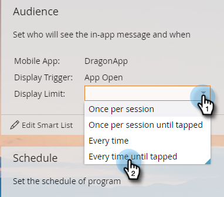

# Ange målgrupp för meddelanden i appen {#set-your-in-app-message-audience}

Det första steget är att bestämma vem som ska få ditt meddelande i appen. Du måste konfigurera din smarta lista.

1. Klicka på **Redigera smart lista**.

   

1. I den smarta listan fylls utlösaren med aktivitet i mobilappar i automatiskt. Klicka på listrutan och välj programmet som du vill placera meddelandet i.

   

   >[!NOTE]
   >
   >Flera värden för fältet Mobilapp stöds för närvarande inte för meddelandeprogram i appen.

1. **Programöppning är** standardinställningen för Åtgärd, men du kan välja alla anpassade händelser som du redan har konfigurerat.

   

   >[!NOTE]
   >
   >Standardutlösaren (App Open) och alla anpassade utlösare som läggs till i koden av din utvecklare visas automatiskt i åtgärdsväljaren. Om en anpassad händelse saknas bör du kontrollera med utvecklaren att de har lagt till anpassade händelser i appen. Tänk på att det kan ta lite tid att slutföra den anpassade händelsekodningen och godkännandeprocessen. Mer information finns i [den här artikeln](/help/marketo/product-docs/mobile-marketing/admin/before-you-create-push-notifications-and-in-app-messages.md).

1. Begränsningar är tillgängliga för utlösaren **Har aktivitet för mobilapp** om du behöver dem.

   

1. Du kan lägga till filter i din smarta lista för att begränsa vem som får ett meddelande i appen. I det här exemplet kommer endast personer som skaffats den 9 juni 2016 att skickas med meddelandet i appen med hjälp av filtret **Anskaffningsdatum**.

   

1. Återgå till Kontrollpanelen för meddelanden i programmet. Ange visningsgränsen i listrutan.

   

   >[!NOTE]
   >
   >Standardvisningsgränsen är **En gång per session**. Om du vill att meddelandet ska sluta visas när mottagaren har svarat väljer du **Varje gång tills användaren knackar på**. Om den ska visas varje gång, oavsett vad mottagaren gör, väljer du **Varje gång**.

   

Snyggt jobbat! Ni har er målgrupp. Du har fått den blå och gröna bockmarkeringen.

Det är dags att [välja meddelandet i appen](/help/marketo/product-docs/mobile-marketing/in-app-messages/sending-your-in-app-message/select-your-in-app-message.md)!
