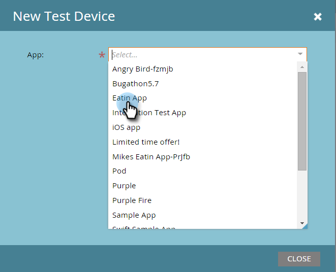

# Lägger till en ny testenhet {#adding-a-new-test-device}

Det är enkelt att lägga till en ny testenhet för att skicka meddelanden till.

>[!NOTE]
>
>**Administratörsbehörigheter krävs**

1. Klicka på **Admin **och sedan på länken **Mobilappar**.\
   

1. Klicka på fliken **Testenheter** och **Ny testenhet**.

   

1. Välj din app.

   

1. Du kan ansluta enheten till appen på två sätt.

   Med det första alternativet kopierar du bara webbadressen från fältet och skickar den i ett e-postmeddelande eller SMS till enheten. Tryck på URL-adressen på enheten.

   

   Eller klicka på den andra knappen med det andra alternativet och skanna QR-koden med enheten.

   

1. Appen öppnas. Namnge enheten och tryck på **Ja**.

   

   Klart!

   

1. Statusuppdateringarna för att visa enheten har lagts till. Grattis!

   

