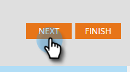

# Konfigurera push-meddelanden för mobilen {#configure-mobile-push-notification}

1. Gå till området **Marknadsföringsaktiviteter**.

   

1. Markera din push-resurs och klicka på **Redigera utkast**.

   

1. Välj önskat program i **Konfigurera**. Android- och Apple-plattformar är aktiverade som standard.

   

   >[!NOTE]
   >
   >Om ditt push-meddelande endast gäller för en plattform (t.ex. iOS) kan du utesluta den andra plattformen genom att manuellt skjuta dess väljare till **Inaktiverad**.

1. Klicka på **Nästa**.

   

1. Ange meddelandetext eller välj tokeikonen för att lägga till tokens (i den här redigeraren formateras [ eftersom de vanligtvis är ](/help/marketo/product-docs/demand-generation/landing-pages/personalizing-landing-pages/tokens-overview.md) - du kan använda flera token). Välj en **Tryck på åtgärd**.

   

   >[!NOTE]
   >
   >Om en plattform är aktiverad visas den till vänster på telefonskärmen. Den visas i färg när den är markerad.

   >[!NOTE]
   >
   >Det finns tre typer av Tap-åtgärder:
   >
   >**Starta appen** - **Den här appen** öppnar appens startsida när användaren trycker på meddelandet. **Anpassad** använder en djuplänk för att öppna andra områden i din app eller något annat program som du har länken till (mer information finns i [Deep Link URI:er](#deep-link-uris) nedan).
   >
   >**Landningssida** - tar dig till en angiven Marketo-landningssida.
   >
   >**Extern URL** - tar dig till en landningssida som inte är Marketo.

1. Om du vill infoga en djuplänk för en anpassad knackningsåtgärd väljer du **Anpassad** och anger [djuplänkens URI](#deep-link-uris) i fältet.

   

   >[!NOTE]
   >
   >Meddelanden och Tryck på Åtgärder ser likadana ut på båda plattformarna.

1. Endast för iOS markerar du kryssrutan för att ange att programmet ska spela upp ett ljud när meddelandet kommer. Android spelar upp ljudet automatiskt.

   

1. Förhandsgranska den andra plattformen och klicka på **Slutför**.

   

1. Klicka på **Godkänn och stäng**.

   

Grattis! Nu är push-meddelandet klart att skickas.

## Deep Link URIs {#deep-link-uris}

När prenumeranter klickar på en knapp i ett push-meddelande kan de antingen gå till appens hemsida eller direkt till en viss sida i appen. En djup länk är en unik referens till en viss sida i appen och ser ut ungefär som en webbplatslänk.

En URI med djup länk består av tre delar: schemanamn, sökväg och identifierare. I exemplet nedan är &quot;myappname&quot; schemat. &quot;products&quot; is the path, and &quot;purple-shirts&quot; is the identifier. När kunden knackar tas de specifikt till den lila skjortan på appens produktsidor.

Programmets djuplänksstruktur kan dock skilja sig från ovanstående exempel. Din utvecklare har många alternativ för att definiera URI:er för djuplänk, så be utvecklaren att skicka URI:er (länkar) till de sidor som du är intresserad av att använda. Detta garanterar att de URI:er som du anger i push-meddelanden pekar på rätt platser. Din utvecklare kan [hitta mer information här](https://experienceleague.adobe.com/sv/docs/marketo-developer/marketo/mobile/enabling-deep-links-in-your-app).

>[!MORELIKETHIS]
>
>[Skicka ett mobilpush-meddelande](/help/marketo/product-docs/mobile-marketing/push-notifications/send-a-mobile-push-notification.md)
