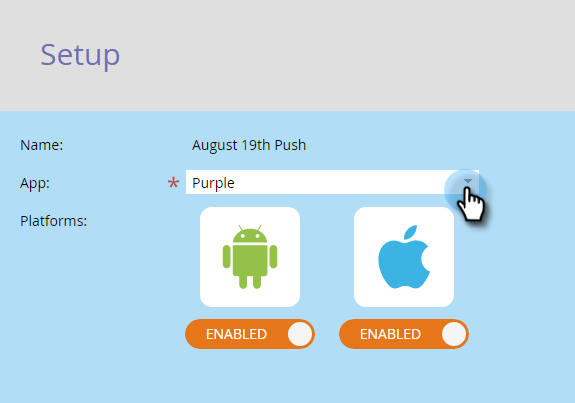

# Konfigurera push-meddelanden för mobilen {#configure-mobile-push-notification}

1. Gå till området Marknadsföringsaktiviteter.

1. Markera din push-resurs och klicka på **Redigera utkast**.

   

1. Gå till **Konfigurera**.

   

1. Välj önskat program. Android- och Apple-plattformarna är aktiverade som standard.

   

   Om ditt push-meddelande endast gäller för en plattform (till exempel för iPhone) kan du utesluta den andra plattformen genom att skjuta dess väljare till Inaktiverad.

   

   Klicka på NÄSTA.

   

1. Ange meddelandetext eller välj token-ikonen om du vill lägga till variabler. Välj sedan en **knackåtgärd**.

   

   >[!NOTE]
   >
   >Om en plattform är aktiverad visas den till vänster på telefonskärmen. Den visas i färg när den är markerad.

   >[!NOTE]
   >
   >**Definition**
   >
   >
   >Det finns tre typer av** Tryck på Åtgärder:**
   >
   >
   >**Starta app** - **Den här appen** öppnar appens startsida när användaren trycker på meddelandet. **Anpassad** använder en djuplänk för att öppna andra områden i din app eller andra appar som du har länken till (mer information finns i [Deep Link URI](#Deeplink) nedan).
   >
   >
   >**Landningssida** - tar dig till en angiven Marketo-landningssida.
   >
   >
   >**Extern URL** - tar dig till en landningssida som inte är markerad.

   Om du vill infoga en djuplänk för en anpassad knackningsåtgärd klickar du på Anpassad och anger [djuplänkens URI](#Deeplink) i fältet.

   

   Om du vill infoga variabler väljer du en token, anger ett standardvärde och klickar på Infoga.

   >[!NOTE]
   >
   >Token visas där du placerar markören i textrutan. Du kan använda mer än en token.

   

   >[!NOTE]
   >
   >Meddelanden och Tryck på Åtgärder ser likadana ut på båda plattformarna.

   För iOS markerar du kryssrutan för att ange att programmet ska spela upp ett ljud när meddelandet kommer. Android spelar upp ljudet automatiskt.

   

   Förhandsgranska den andra plattformen och klicka på FINISH.

   

1. Klicka på **GODKÄNN OCH STÄNG**.

   

Grattis! Nu är push-meddelandet klart att skickas.

## Deep Link URIs {#deep-link-uris}

När prenumeranter klickar på en knapp i ett push-meddelande kan de antingen gå till appens hemsida eller direkt till en viss sida i appen. En djup länk är en unik referens till en viss sida i appen och ser ut ungefär som en webbplatslänk.

En djuplänk-URI består av tre delar: schemanamn, sökväg och identifierare. I exemplet nedan är &quot;myappname&quot; schemat. &quot;products&quot; is the path, and &quot;purple-shirts&quot; is the identifier. När kunden knackar tas de specifikt till den lila skjortan på appens produktsidor.

Programmets djuplänksstruktur kan dock skilja sig från ovanstående exempel. Din utvecklare har många alternativ för att definiera URI:er för djuplänk, så be utvecklaren att skicka URI:er (länkar) till de sidor som du är intresserad av att använda. Detta garanterar att de URI:er som du anger i push-meddelanden pekar på rätt platser. Din utvecklare kan [hitta mer information här](http://developers.marketo.com/mobile/enabling-deep-links-in-your-app/).

>[!NOTE]
>
>**Relaterade artiklar**
>
>* [Skicka ett mobilpush-meddelande](send-a-mobile-push-notification.md)

>

