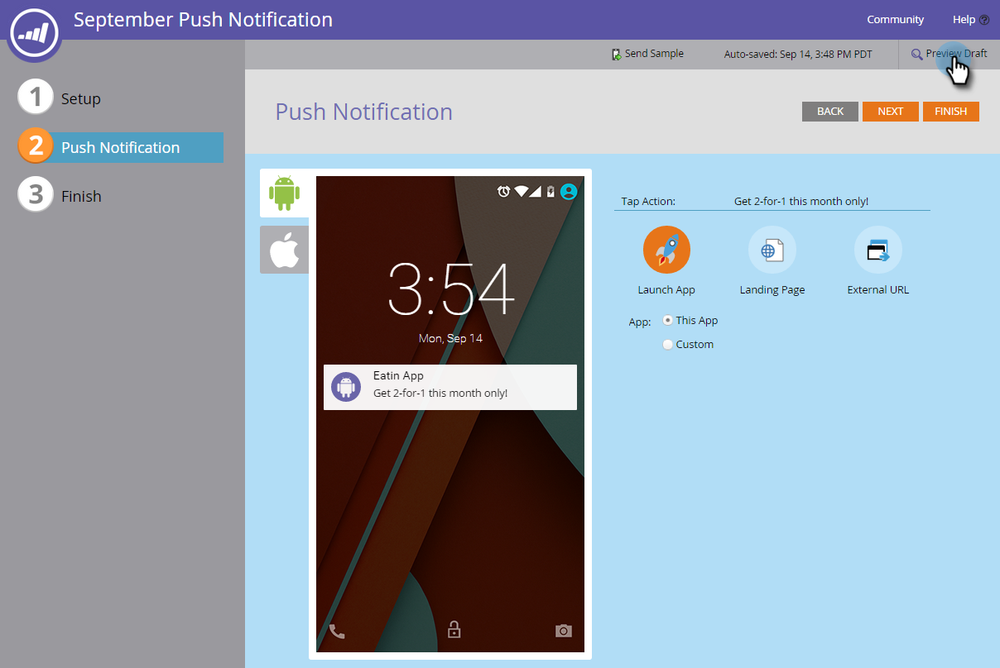

# Förhandsgranska ett push-meddelande {#preview-a-push-notification}

Det är enkelt att förhandsgranska hur ditt push-meddelande kommer att se ut, antingen för Android eller iOS. Det finns fyra sätt att göra det på.

Högerklicka på filen i navigeringsträdet för meddelandet som du vill förhandsgranska och klicka på **Förhandsgranska**.

>[!NOTE]
>
>Om push-meddelanden bara är aktiverat för en plattform visas inte fliken för den andra plattformen.

Du kan också klicka på **Push Notifications Actions** på sidan Push Notification (Push-meddelanden-vy) och sedan **Preview**. Eller klicka på **Förhandsgranska **längst till höger.** **

I redigeraren kan du slutligen klicka på fliken **Förhandsgranska utkast** i det övre högra hörnet när du arbetar med meddelandet.

## Android-förhandsvisningar {#android-previews}

Klicka på ikonen till vänster för att se exakt var push-meddelandet visas när du skickar det. Klicka på eller använd tangentbordspilarna för att växla mellan dem.

På hemskärmen visas meddelandet lite under överkanten, under ikonerna.

På låsskärmen visas den upp och ned under tiden.

>[!NOTE]
>
>Det finns ingen meddelandecentervy i Android.

## iOS-förhandsvisningar {#ios-previews}

Precis som med Android kan du växla mellan vyer genom att klicka på eller använda tangentbordspilar.

På hemskärmen visas meddelandet högst upp.

På skärmen Lås visas motsatt sida.

På Notiscenter-skärmen är den uppe uppe,

Med förhandsgranskning av push-meddelanden vet ni alltså alltid vad kunderna kommer att se!

>[!NOTE]
>
>**Relaterade artiklar**
>
>* [Skapa ett push-meddelande](create-a-push-notification.md)
>* [Konfigurera push-meddelanden för mobilen](configure-mobile-push-notification.md)

>

