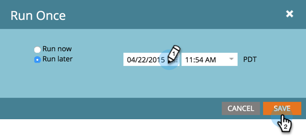

# Skicka ett mobilpush-meddelande {#send-a-mobile-push-notification}

Skicka ett push-meddelande till personer som använder din mobilapp.

>[!PREREQUISITES]
>
>* [Skapa en ny smart kampanj](/help/marketo/product-docs/core-marketo-concepts/smart-campaigns/creating-a-smart-campaign/create-a-new-smart-campaign.md)
>* [Skapa ett push-meddelande](/help/marketo/product-docs/mobile-marketing/push-notifications/create-a-push-notification.md)

1. Gå till området **[!UICONTROL Marketing Activities]**.

   

1. Välj din smarta kampanj och klicka på **[!UICONTROL Smart List]**.

   

1. Definiera din smarta lista och klicka sedan på **[!UICONTROL Flow]**.

   

1. Välj ett push-meddelande. Klicka på **[!UICONTROL Schedule]**.

   

   >[!NOTE]
   >
   >Push-meddelandet måste godkännas innan det visas i listrutan.

1. Klicka på **[!UICONTROL Run Once]**.

   

1. Välj ett datum och en tid. Klicka på **[!UICONTROL Save]**.

   

Vänta på att ditt push-meddelande ska skickas ut.
