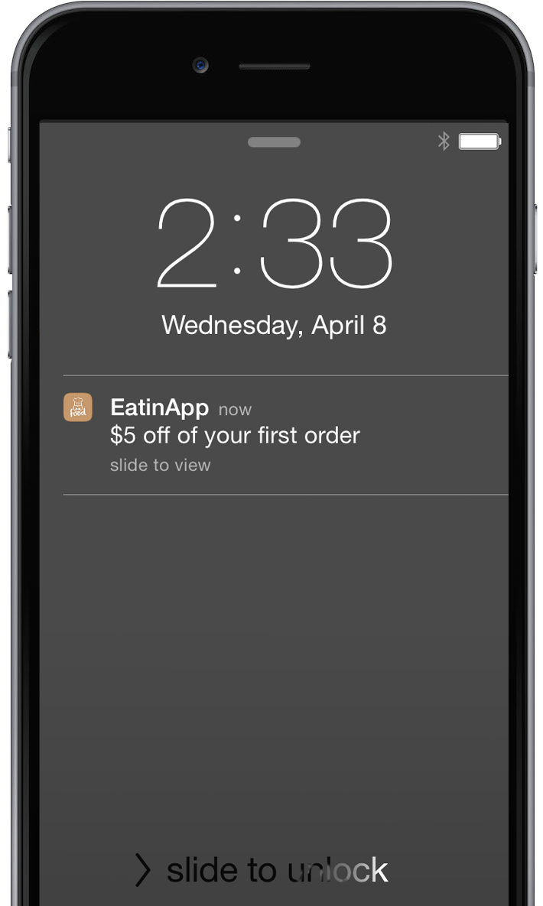

# Förstå push-meddelanden {#understanding-push-notifications}

>[!NOTE]
>
>Meddelanden i appen är ett tilläggsprogram. Bekräfta med er Marketo-kontohanterare för att vara säker på att den är aktiverad.

Med Marketo Mobile Engagement kan ni skapa, konfigurera och skicka ett meddelande precis som ni skulle skapa ett e-postmeddelande.  Innan du kan skapa och skicka push-meddelanden från din mobilapp behöver du Marketo Admin och utvecklaren av mobilappar för att kunna göra några inställningar.

>[!CAUTION]
>
>Push-meddelanden är ett tillägg och måste aktiveras av en Marketo-administratör innan du startar.

## Steg 1: Administratör och utvecklare utför initiala inställningar {#step-admin-and-developer-perform-initial-setups}

Marketo Admin och utvecklaren av mobilappar samarbetar för att konfigurera dig. Mer information finns i [Innan du skapar push-meddelanden och meddelanden](../../../product-docs/mobile-marketing/admin/before-you-create-push-notifications-and-in-app-messages.md) i appen.

## Steg 2: Skapa ett push-meddelande {#step-create-a-push-notification}

[Skapa meddelanden](create-a-push-notification.md) och förhandsgranska hur de visas på Android- och iOS-enheter.

## Steg 3: Skicka! {#step-send}

[Push-meddelanden kan skickas](send-a-mobile-push-notification.md) med smarta utlösar- och batchkampanjer. Ganska coolt, va?

>[!NOTE]
>
>* Ett push-meddelande visas inte på skärmen förrän appen har öppnats minst en gång.
>* För iOS-appar visas inte ett push-meddelande på skärmen om det program som är avsett att ta emot push-meddelandet är öppet och aktivt. I stället visas meddelandet i programmets lokala meddelandeområde.

