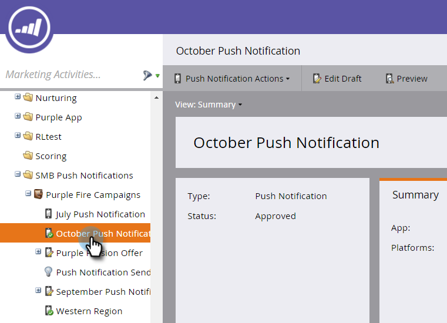

# Visa kontrollpanelen för push-meddelanden {#view-the-push-notification-dashboard}

Det är enkelt att se hur dina push-meddelanden fungerar.

1. Gå till området **[!UICONTROL Marketing Activities]**.

   

1. Välj kampanj.

   

1. Klicka på **[!UICONTROL View: Summary]** och välj **[!UICONTROL Dashboard]**.

   

1. Du kan visa [!UICONTROL Total Sent] och [!UICONTROL Total Taps] för iOS och Android i cirkeldiagram. Bläddra nedåt om du vill se [!UICONTROL Tap Decay] i stapeldiagram.

   

   >[!NOTE]
   >
   >Måttet _Skickat_ kan visa fler utskick än det exakta antalet personer som push-meddelandet skickades till. Det beror på att det beräknas baserat på *antalet enheter* som är kvalificerade att ta emot din push-överföring. Om en person till exempel har tre enheter registrerar kontrollpanelen tre utskick, inte en.

   >[!MORELIKETHIS]
   >
   >* [Förstå push-meddelanden](/help/marketo/product-docs/mobile-marketing/push-notifications/understanding-push-notifications.md)
   >* [Skicka ett mobilpush-meddelande](/help/marketo/product-docs/mobile-marketing/push-notifications/send-a-mobile-push-notification.md)
