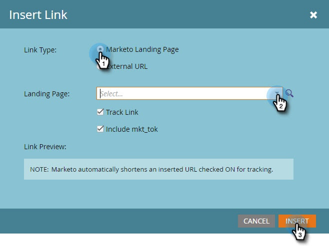

# Skapa ett Vibes SMS-meddelande {#create-a-vibes-sms-message}

Så här skapar du ett Vibes SMS-meddelande.

>[!AVAILABILITY]
>
>Den här funktionen är tillgänglig som tillägg för ditt Adobe Marketo Engage-konto. För att den ska kunna tillhandahållas på rätt sätt måste den köpas via Adobe. Kontakta kontoteamet (din kontoansvarige) för mer information.

1. Gå till **Marknadsföringsaktiviteter**.

   

1. Högerklicka på ett program och välj **Ny lokal resurs**.

   

1. Klicka **Ny lokal resurs**.

   

   >[!TIP]
   >
   >Du kan även klicka på **Nytt** nedrullningsbar meny.

1. Klicka **SMS-meddelande**.

   

1. Ange ett namn och en valfri beskrivning för det nya SMS-meddelandet och klicka på **Skapa**.

   

1. Klicka **Redigera utkast**.

   

1. Klicka i den blå bubblan i meddelanderedigeraren och börja skriva text.

   

   >[!NOTE]
   >
   >USA och Kanada har olika gränser, med 160 respektive 130 tecken. Om du överskrider teckengränserna kan meddelandet delas upp. Vi visar när du överskrider gränsen för Kanada, men redigeraren är optimerad för USA och delar upp meddelandet baserat på USA:s gräns.

1. Klicka **Token** på Infoga-menyn för att lägga till en token i meddelandet.

   

   >[!NOTE]
   >
   >Om du lägger till en variabel kan meddelandet överskrida teckengränsen. Meddelandet delas sedan upp, vilket medför ytterligare kostnader.

1. Klicka **Länk** på Infoga-menyn för att lägga till en länk till meddelandet.

   

1. Välj en länktyp. Marketo landningssida är standard. Om du går med på det måste du välja landningssidan i listrutan och klicka på **Infoga**.

   

   >[!NOTE]
   >
   >De två spårningslänkarna är markerade som standard.

1. Om du vill använda en extern URL i stället klickar du på **Extern URL** och ange URL-adressen i URL-fältet. Klicka **Infoga**.

   

1. Länken visas i meddelandet.

   

   >[!NOTE]
   >
   >Marketo visar en länkförhandsgranskning av domänen för varumärkesspårning. Om du avmarkerar kryssrutan för länken mkt_tok ändras länken. Avmarkera kryssrutan Spåra länk också så förkortas URL-adressen till dess grundläggande längd (till exempel www.mygooglepage.com).

   

   >[!NOTE]
   >
   >Teckenantalet återspeglar endast tecknen i det lägsta meddelandet.

Om du infogar mer än USA:s gräns bryts meddelandet ned i avsnitt. Det finns en absolut gräns på 900 tecken. När gränsen har nåtts trunkeras meddelandet automatiskt när det skickas till målgruppen.
