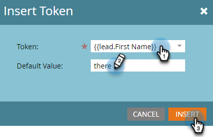

# Skapa ett SMS-meddelande {#create-an-sms-message}

Så här skapar du ett SMS-meddelande.

>[!AVAILABILITY]
>
>Den här funktionen är tillgänglig som tillägg för ditt Adobe Marketo Engage-konto. För att den ska kunna tillhandahållas på rätt sätt måste den köpas via Adobe. Kontakta kontoteamet (din kontoansvarige) för mer information. Integrering av Marketo Vibes SMS finns i USA och Kanada. I andra länder kan en anslutning via Marketo Webhooks användas av [kontakta Vibes direkt](https://www.vibes.com/talk-to-sales).

>[!PREREQUISITES]
>
>[Lägg till vibes som en LaunchPoint-tjänst](/help/marketo/product-docs/mobile-marketing/admin/add-vibes-as-a-launchpoint-service.md){target="_blank"}

1. Gå till **[!UICONTROL Marketing Activities]**.

   

1. Högerklicka på önskat program och välj **[!UICONTROL New Local Asset]**.

   

1. Välj **SMS-meddelande**.

   

1. Ange ett namn och en valfri beskrivning för det nya SMS-meddelandet och klicka på **Skapa**.

   

1. Klicka i den blå bubblan i redigeraren och börja skriva text.

   

   >[!NOTE]
   >
   >Teckengränsen för ett SMS-meddelande är 160 tecken med ASCII-standardteckenuppsättningen. Om du överskrider 160 tecken delas meddelandet upp baserat på det totala antalet tecken.

1. Om du vill lägga till en token i meddelandet skriver du en snabbhälsning och klickar på **Token**.

   

   >[!NOTE]
   >
   >Om du lägger till en variabel kan meddelandet överskrida teckengränsen. Meddelandet delas sedan upp och ytterligare ett meddelande skapas.

   >[!IMPORTANT]
   >
   >SMS-kompatibilitet: Alla utgående SMS-meddelanden måste innehålla varumärkesnamnet eller programbeskrivningen. HJÄLP- och STOP-anvisningar ska ges minst en gång per månad och prenumerant för program för återkommande meddelanden.

1. Markera önskat **Token**, ange ett valfritt **Standardvärde** och klicka **Skapa**.

   

1. Om du vill lägga till en länk väljer du var i meddelandet som du vill att den ska visas och klickar på **Länk**.

   

1. Välj en länktyp. Marketo landningssida är standard. Om du väljer det klickar du på listrutan Landningssida och väljer önskad sida. Klicka **Infoga** när det är klart.

   

   >[!NOTE]
   >
   >De två spårningslänkarna är markerade som standard. Om du avmarkerar enbart Include mkt_tok kan länken fortfarande spåras, men efter omdirigeringen kommer mål-URL:en inte att innehålla frågesträngsparametern mkt_tok. Den här parametern används av Marketo Landing Pages och Munchkin för att säkerställa korrekt spårning av personaktiviteter (som när en person avanmäler sig).

1. Om du vill använda en extern URL i stället väljer du **Extern URL**, ange/klistra in URL-adressen och klicka på **Infoga**.

   

   >[!NOTE]
   >
   >När Spåra länk är markerat ändrar Marketo automatiskt URL:en i spårningssyfte. Om du avaktiverar spårning visas URL:en i meddelandet i oförändrad form (t.ex. `www.adobe.com`).

   >[!CAUTION]
   >
   >Vi rekommenderar _not_ Använd URL-förkortningar (t.ex. Bitly) eftersom bärarna kan flagga ditt meddelande som skräppost.

1. Länken visas i meddelandet.

   

   >[!NOTE]
   >
   >Marketo visar en länkförhandsgranskning av domänen för varumärkesspårning. Om du avmarkerar kryssrutan för länken mkt_tok ändras länken.

Om du infogar fler än 160 tecken delar redigeraren upp ditt SMS i avsnitt. Det finns en total gräns på 900 tecken per meddelande. Om du överskrider det kommer meddelandet att trunkeras vid leveransen.
