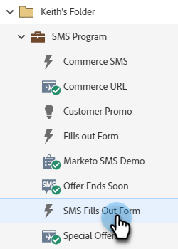

# Skicka ett Vibes SMS-meddelande {#send-a-vibes-sms-message}

Du har [skapade ditt Vibes SMS-meddelande](/help/marketo/product-docs/mobile-marketing/vibes-sms-messages/create-a-vibes-sms-message.md), nu är det dags att skicka det. Du kan skicka det via Gruppera eller Utlös kampanj.

>[!NOTE]
>
>När SMS-meddelanden skickas:
>
>* Marketo Engage dedupes per telefonnummer. Om flera personer har samma telefonnummer får bara en person meddelandet om de bara är medlemmar i en prenumerationslista för Adobe. Deduping görs på prenumerationslistenivån för Vibes, inte på programnivån för Marketo.
>* Marketo skickar inte till personer som är blocklist eller har avbrutit sin marknadsföring.

## Skicka ett batch-SMS {#send-a-batch-sms}

1. I Min Marketo klickar du på **Marknadsföringsaktiviteter**.

   

1. Hitta och välj önskad smart kampanj.

   

1. Klicka på **Smart List** och definiera målgruppen för SMS:et. I det här exemplet skickar vi till alla i vår databas som har &quot;Adobe&quot; som företag.

   

1. I **Flöde** tabb, dra över **Skicka SMS-meddelande**. Välj önskad SMS-meddelande och Vibes-lista i listrutorna.

   

   >[!NOTE]
   >
   >Väljaren Vibes List fungerar som ett ytterligare filter för den målgrupp som redan identifierats i Smart List så att den endast riktar sig till personer som tillhör den listan.

1. Klicka på **Schema** och schemalägga ditt SMS.

   

## Skicka utlösar-SMS {#send-a-trigger-sms}

1. I Min Marketo klickar du på **Marknadsföringsaktiviteter**.

   

1. Hitta och välj önskad smart kampanj.

   

1. Klicka på **Smart List** väljer du önskad utlösare och definierar dess värde. I detta exempel använder vi **Fyller i formulär**.

   

1. I **Flöde** tabb, dra över **Skicka SMS-meddelande**. Välj önskad SMS-meddelande och Vibes-lista i listrutorna.

   

   >[!NOTE]
   >
   >Väljaren Vibes List fungerar som ett ytterligare filter för den målgrupp som redan identifierats i Smart List så att den endast riktar sig till personer som tillhör den listan.

1. Klicka på **Schema** tabbtangenten, sedan **Aktivera**.

   

>[!MORELIKETHIS]
>
>* [Skapa ett Vibes-meddelande](/help/marketo/product-docs/mobile-marketing/vibes-sms-messages/create-a-vibes-sms-message.md)
>* Vibes Flow Steps

