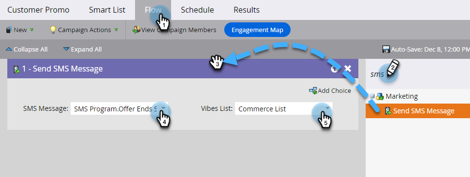

# Skicka ett SMS {#send-a-vibes-sms-message}

Du har [skapat SMS-meddelandet](/help/marketo/product-docs/mobile-marketing/vibes-sms-messages/create-an-sms-message.md){target="_blank"}, nu är det dags att skicka det. Du kan skicka det via Gruppera eller Utlös kampanj.

>[!NOTE]
>
>När SMS-meddelanden skickas:
>
>* Marketo Engage dedupes per telefonnummer. Om flera personer har samma telefonnummer får bara en person meddelandet om de bara är medlemmar i en prenumerationslista för Adobe. Deduping görs på prenumerationslistenivån för Vibes, inte på programnivån för Marketo.
>* Marketo skickar inte till personer som är blocklist eller har avbrutit sin marknadsföring.
>* Ett SMS-meddelande kommer inte att skickas till någon som avbeställt prenumerationen om de inte finns med i listan Vibes Mobile Database.

## Skicka ett batch-SMS {#send-a-batch-sms}

1. Klicka på **Marknadsföringsaktiviteter** i Min Marketo.

   

1. Hitta och välj önskad smart kampanj.

   

1. Klicka på fliken **Smart lista** och definiera målgruppen för SMS:et. I det här exemplet skickar vi till alla i vår databas som har &quot;Adobe&quot; som företag.

   

1. Dra över **Skicka SMS** på fliken **Flöde**. Välj önskad SMS-meddelande och Vibes-lista i listrutorna.

   

   >[!NOTE]
   >
   >Väljaren Vibes List fungerar som ett ytterligare filter för den målgrupp som redan identifierats i Smart List så att den endast riktar sig till personer som tillhör den listan.

1. Klicka på fliken **Schemalägg** och schemalägg ditt SMS.

   

## Skicka utlösar-SMS {#send-a-trigger-sms}

1. Klicka på **Marknadsföringsaktiviteter** i Min Marketo.

   

1. Hitta och välj önskad smart kampanj.

   

1. Klicka på fliken **Smart lista**, markera önskad utlösare och definiera dess värde. I det här exemplet använder vi **Fyll i formulär**.

   

1. Dra över **Skicka SMS** på fliken **Flöde**. Välj önskad SMS-meddelande och Vibes-lista i listrutorna.

   

   >[!NOTE]
   >
   >Väljaren Vibes List fungerar som ett ytterligare filter för den målgrupp som redan identifierats i Smart List så att den endast riktar sig till personer som tillhör den listan.

1. Klicka på fliken **Schema** och sedan på **Aktivera**.

   

>[!MORELIKETHIS]
>
>* [Skapa ett Vibes-meddelande](/help/marketo/product-docs/mobile-marketing/vibes-sms-messages/create-an-sms-message.md){target="_blank"}
>* [Använda SMS-alternativ i en smart kampanj](/help/marketo/product-docs/mobile-marketing/vibes-sms-messages/using-sms-options-in-a-smart-campaign.md){target="_blank"}
