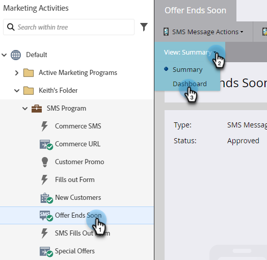

# SMS-rapportering {#sms-reporting}

Kontrollpanelen för SMS-meddelanden ger användbar analys av dina meddelanden.

## Åtkomst till instrumentpanelen {#access-the-dashboard}

1. Om du vill visa rapporten väljer du önskat SMS-meddelande. Klicka på listrutan **Visa** och välj **Kontrollpanel**.

   

1. Kontrollpanelen visas.

   

## Översikt över instrumentpanelen {#dashboard-overview}

### SMS-progression {#sms-progression}

Visar totalt antal skickade och totalt levererade. Beloppen finns till höger, och om du håller markören över en stapel visas procentandelen.

### Sammanfattning {#summary}

Visar den beräknade studsfrekvensen i procent. Håll pekaren över stapeln om du vill visa leveransfrekvensen per belopp och procent. Håll muspekaren över den orangefärgade studsfrekvensen i fältet om du vill visa mängden/procentsatserna Mjuk och Hård studsfrekvens.

### Aktivitet över tid {#activity-over-time}

Gör att du kan välja Totalt skickat eller Totalt levererat. Välj ett lämpligt intervall från datumintervallväljaren.

