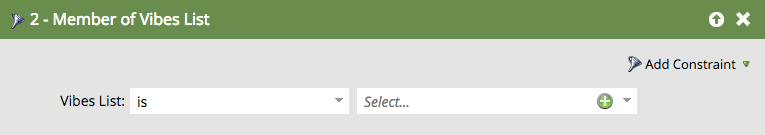

# Använd Vibes SMS-meddelanden i Smart List-utlösare och -filter {#use-vibes-sms-messages-in-smart-list-triggers-and-filters}

När du har [skapat ett Vibes SMS-meddelande](create-a-vibes-sms-message.md)vill du använda smarta listutlösare och filter i en smart kampanj för att få fördelarna. Så här gör du.

1. Klicka på **Marknadsföringsaktiviteter** på My Marketo.

   

1. Välj en smart kampanj där du vill använda din SMS-resurs. Dra över en utlösare, t.ex. det populära **Fyll i formulär**.

   

## SMS-utlösare {#sms-triggers}

Det finns andra SMS-utlösare tillgängliga. SMS-utlösarna visas bara om tjänsten Vibes är aktiverad.

Här är några exempel.

SMS Message Bounces-utlösaren initierar ett flöde, som att skicka ett e-postmeddelande, när ett SMS-meddelande studsar.

Utlösaren **Prenumererar på Vibes List** initierar ett flöde när en person prenumererar.

Utlösaren för att* klicka på länken i SMS-meddelande** startar ett flöde när en person klickar på en länk i SMS-meddelandet.

## SMS-filter {#sms-filters}

Du kan också använda Vibes-filter i smarta listor. Filtret **Prenumerera på Vibes-lista** hittar alla som *någonsin* prenumererar på Vibes. Detta inkluderar både personer som inte längre är prenumererade och borttagna, även om borttagna personer utelämnas från flödet. Det här filtret passar bäst för rapportering.

Däremot **hittar** **filtret **Member of Vibes List** vem som helst ****** som ** prenumererar på Vibes och är mest lämpligt att använda i smarta kampanjer eller listor.

>[!NOTE]
>
>Alla SMS-filter innehåller begränsningen **Aktivitetsdatum** som standard.

När du har konfigurerat Vibes-utlösare och -filter i din smarta lista kan du [definiera flödet](add-a-flow-step-for-sms.md).

>[!MORELIKETHIS]
>
>* [Definiera smart lista för smart kampanj | Utlösare](../../../product-docs/core-marketo-concepts/smart-campaigns/creating-a-smart-campaign/define-smart-list-for-smart-campaign-trigger.md)
>* [Söka efter och lägga till filter i en smart lista](../../../product-docs/core-marketo-concepts/smart-lists-and-static-lists/creating-a-smart-list/find-and-add-filters-to-a-smart-list.md)
>* [Lägg till ett flödessteg för SMS](add-a-flow-step-for-sms.md)

>

