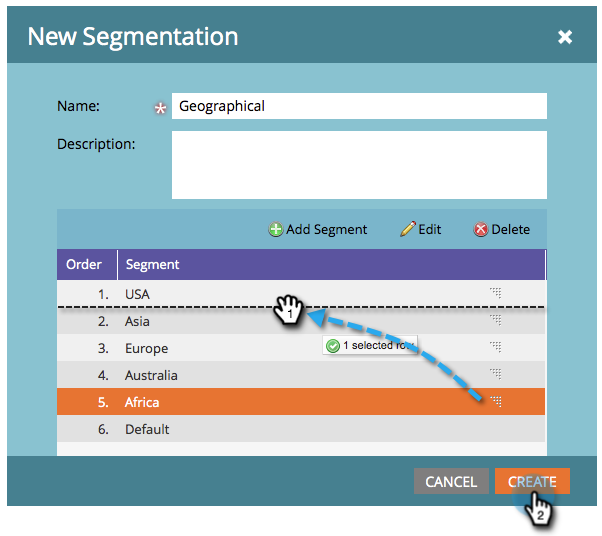

# Skapa en segmentering {#create-a-segmentation}

Med segmentering kan ni gruppera människor i olika profiler för rapportering och dynamiskt innehåll. Så här skapar du dem.

>[!NOTE]
>
>**FYI**
>
>Marketo standardiserar nu språk för alla prenumerationer, så du kan se lead/leads i din prenumeration och person/personer på docs.marketo.com. Dessa termer betyder samma sak. det påverkar inte artikelinstruktionerna. Det finns andra förändringar också. [Läs mer](http://docs.marketo.com/display/DOCS/Updates+to+Marketo+Terminology).

1. Gå till **databas**.

   

1. Klicka på **New **och sedan **New Segmentation**.

   

   >[!TIP]
   >
   >Du kan skapa upp till 20 segment.

1. Ange ett **namn**, klicka på** Lägg till** **segment** och ge det ett namn.

   

   >[!NOTE]
   >
   >Det går inte att flytta, redigera eller ta bort standard.

1. Lägg till så många segment du vill (upp till 100).

   

   >[!CAUTION]
   >
   >Det totala antalet segment som du kan skapa i en segmentering beror på antalet och typen av filter som används och även på hur komplex logiken i segmenten är. Du kan skapa upp till 100 segment med hjälp av standardfält, men med andra typer av filter kan det bli mer komplicerat och segmenteringen kanske inte kan godkännas. Några exempel är: anpassade fält, listmedlem, fält för huvudägare och intäktsfaser.
   >
   >
   >Om du får ett felmeddelande under godkännandet och behöver hjälp med att minska komplexiteten i din segmentering kontaktar du [Marketo Support](http://docs.marketo.com/cdn-cgi/l/email-protection#e794929797889593a78a86958c829388c984888a).

1. Dra och släpp segmenten runt för att ändra deras ordning. Klicka på **Skapa** när du är klar.

   

   >[!NOTE]
   >
   >En person kvalificerar sig för det första matchande segmentet i den [definierade ordningen](segmentation-order-priority.md) .

   >[!NOTE]
   >
   >**Påminnelse**
   >
   >
   >Du måste definiera segmentregler innan du kan använda segmenteringen.

   >[!NOTE]
   >
   >**Relaterade artiklar**
   >
   >    
   >    
   >    * [Definiera segmentregler](define-segment-rules.md)

Grattis! Du är ett steg närmare att använda dynamiskt innehåll.