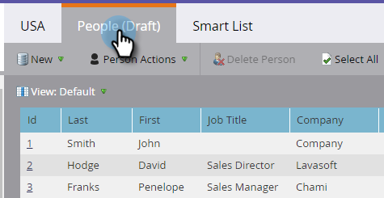

# Definiera segmentregler {#define-segment-rules}

Genom att definiera segmentregler kan du kategorisera dina personer i olika grupper som inte kan kombineras.

>[!PREREQUISITES]
>
>[Skapa en segmentering](/help/marketo/product-docs/personalization/segmentation-and-snippets/segmentation/create-a-segmentation.md)

1. Gå till **[!UICONTROL Database]**.

   

1. Välj **[!UICONTROL Segmentations]** i trädet och klicka sedan på ett visst **segment**.

   

1. Klicka på **[!UICONTROL Smart List]** och lägg till filter.

   

   >[!CAUTION]
   >
   >Segment har för närvarande inte stöd för operatorerna _I föregående_ och _I tidsram_ på filter. Det beror på att segmenteringar bara söker efter uppdateringar när ett ändringsdatavärde loggas. Dessa värden är _inte_ loggade för saker som ändras automatiskt, till exempel formelfält och datum. Dessutom stöds inte datumoperatorer med relativa datumintervall eftersom de beräknas vid tidpunkten för segmenteringsgodkännande, inte vid tidpunkten för en Ändra datavärdesaktivitet.

   >[!NOTE]
   >
   >Filtren&quot;SFDC Type&quot; och&quot;Microsoft Type&quot; stöds för närvarande inte i smarta segmenteringslistor.

1. Fyll i lämpliga värden för filtren.

   

   >[!CAUTION]
   >
   >Aktivitetsloggningsbeteendet för kontofält kan påverka kvalificeringen. Därför rekommenderar vi att du inte använder kontofält när du definierar segmentregler.

1. Klicka på fliken **[!UICONTROL People (Draft)]** för att visa de personer som kan kvalificera sig som medlemmar i det här segmentet.

   

1. Gå till **[!UICONTROL Segmentation Actions]**. Klicka på **[!UICONTROL Approve]**.

   

   >[!CAUTION]
   >
   >Det totala antalet segment som du kan skapa i en segmentering beror på antalet och typen av filter som används och även på hur komplex logiken i segmenten är. Du kan skapa upp till 100 segment med hjälp av standardfält, men med andra typer av filter kan det bli mer komplicerat och segmenteringen kanske inte kan godkännas. Några exempel är: anpassade fält, listmedlem, leadägarfält och intäktsfaser.
   >
   >Om du får ett felmeddelande under godkännandet och behöver hjälp med att minska komplexiteten i din segmentering kontaktar du [Marketo Support](https://nation.marketo.com/t5/Support/ct-p/Support).

1. På kontrollpanelen hittar du en snabb översikt över segmenten i ett cirkeldiagram samt vilka regler som används.

   

Bra jobbat! De här segmenten kommer att bli bra på många ställen i Marketo.

>[!NOTE]
>
>En person kan kvalificera sig för olika segment, men tillhör så småningom bara ett som är beroende av [prioritetsordningen för segmenten](/help/marketo/product-docs/personalization/segmentation-and-snippets/segmentation/segmentation-order-priority.md).

>[!NOTE]
>
>På skärmen [!UICONTROL People (Draft)] visas alla personer som är kvalificerade att vara medlemmar och som inte alltid är den slutliga listan över personer. Godkänn segmentet för att se den slutliga listan.

>[!MORELIKETHIS]
>
>[Godkänn en segmentering](/help/marketo/product-docs/personalization/segmentation-and-snippets/segmentation/approve-a-segmentation.md)
