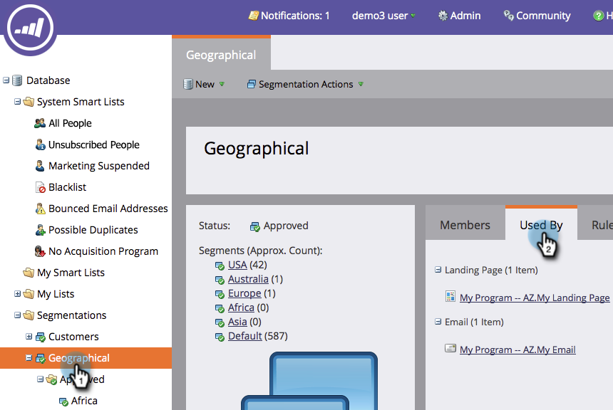
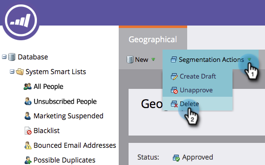

# Ta bort ett segment {#delete-a-segmentation}

Du kan ta bort en segmentering genom att följa stegen nedan.

1. Gå till **databasen**.

   

1. Gå till din segmentering och klicka på **Används av** för att kontrollera associationer.

   

   Om din segmentering används av andra resurser tar du bort alla dessa associationer innan du fortsätter.

1. Ta bort alla associationer och klicka sedan i **Segmenteringsåtgärder** på **Ogodkänd** i &lt;a0/>Segmenteringsåtgärder&lt;a1/>.

   

   >[!NOTE]
   >
   >Du kan ta bort associationer genom att ta bort eller skapa alternativ för resurserna som använder segmenteringen.

   Klicka på Segmenteringsåtgärder och ta bort segmenteringen när det inte godkänts.

   

Så där. Du kan inte få tillbaka den, så se till att du inte behöver den längre.
