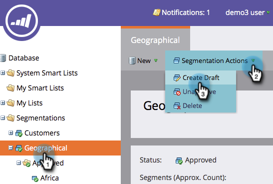
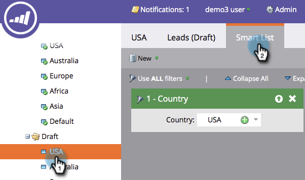

# Redigera en segmentering {#edit-a-segmentation}

Det är enkelt att ändra befintliga segment. Här är det låga ner.

## Skapa ett segmenteringsutkast {#create-a-segmentation-draft}

1. Gå till **databasen**.

   

1. Klicka på **Segmenteringsåtgärder** i segmenteringen och **Skapa utkast**.

   

1. **Status **ändras till Godkänd med utkast. En **Draft **folder skapas i din segmentering.

   

## Lägg till, redigera eller ta bort segment {#add-edit-or-delete-segments}

1. I segmenteringen klickar du på **Segmenteringsåtgärder** och sedan på **Redigera segment**.

   

   >[!NOTE]
   >
   >Du kan bara redigera segment i ett utkast och inte i Godkänt segment.

1. **Lägg till segment**, **Redigera **befintlig (ändra namn eller ordning) eller **Ta bort **alla segment.

   

   >[!NOTE]
   >
   >Du måste markera ett segment innan du kan redigera eller ta bort det.

   >[!CAUTION]
   >
   >Borttagningen påverkar allt associerat dynamiskt innehåll i e-postmeddelanden, landningssidor och fragment. **Det går inte att ångra**. Kontrollera fliken **Används av** för att se vad som använder segmentet.

## Redigera segmentregler {#edit-segment-rules}

1. Gå till **Smart** lista **i utkastsegmentet**. Använd regler som liknar [Definiera segmentregler](http://docs.marketo.com/display/public/DOCS/Define+Segment+Rules).

   

   >[!NOTE]
   >
   >Du kan inte redigera dina godkända segment. Klicka på Segment i mappen Utkast för att redigera dem.

   >[!NOTE]
   >
   >**Påminnelse**
   >
   >
   >Kom ihåg att godkänna segmenteringsutkastet.

Experimentera fritt med segmenteringar som inte används i dynamiskt innehåll.

>[!NOTE]
>
>**Relaterade artiklar**
>
>* [Ta bort en segmentering](delete-a-segmentation.md)

>

