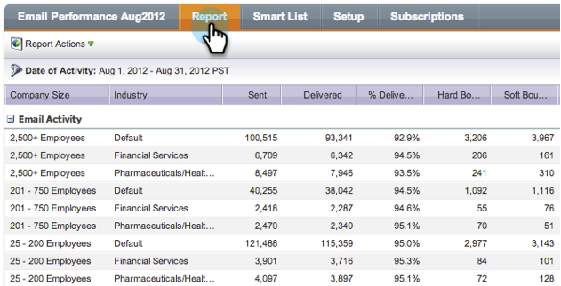

# Gruppera e-postrapporter efter segment {#group-email-reports-by-segmentations}

Segmenteringar är inte bara för dynamiskt innehåll. Du kan också gruppera din [e-postrapport](../../../../product-docs/email-marketing/email-programs/email-program-data/email-performance-report.md) efter [segmenteringar](http://docs.marketo.com/display/docs/segmentation+and+snippets).

>[!NOTE]
>
>**Förutsättningar**
>
>* [Godkänn en segmentering](approve-a-segmentation.md)

>

1. Gå till området **Marknadsföringsaktiviteter** (eller **Analytics**).

   

1. Välj din **rapport om e-postprestanda** .

   

1. Klicka på fliken **Inställningar** och dra över **Gruppera efter segment**.

   

1. Välj en eller två segmenteringar som du vill använda för att gruppera rapporten. Klicka på **ANVÄND**.

   

1. Så ja! Klicka på fliken **Rapport** . Om du använder en segmentering visar rapporten en rad för varje segment.

   

1. Om du använder två segmenteringar visas en rad för varje *kombination* av segment.

   

>[!NOTE]
>
>**Relaterade artiklar**
>
>* [Filtrera resurser i en e-postrapport](../../../../product-docs/reporting/basic-reporting/report-activity/filter-assets-in-an-email-report.md)

>

