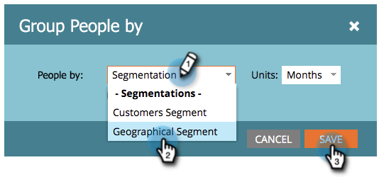

# Gruppera personrapporter efter segment {#group-person-reports-by-segment}

Du kan gruppera dina [personrapporter](http://docs.marketo.com/display/docs/basic+reporting) efter [segment](http://docs.marketo.com/display/docs/basic+reporting) som du har [definierat i segmenteringarna](create-a-segmentation.md).

>[!NOTE]
>
>**FYI**
>
>Marketo standardiserar nu språk för alla prenumerationer, så du kan se lead/leads i din prenumeration och person/personer på docs.marketo.com. Dessa termer betyder samma sak. det påverkar inte artikelinstruktionerna. Det finns andra förändringar också. [Läs mer](http://docs.marketo.com/display/DOCS/Updates+to+Marketo+Terminology).

1. Gå till avsnittet **Marknadsföringsaktiviteter** (eller **Analytics**).

   

1. Välj din personrapport i navigeringsträdet.

   

   >[!NOTE]
   >
   >**Djupdykning**
   >
   >
   >Läs mer om personrapporter och andra rapporttyper i djupdykningen för [grundläggande rapportering](http://docs.marketo.com/display/docs/basic+reporting) .

1. Klicka på fliken **Inställningar** och dubbelklicka på **Gruppera personer efter**.

   

   >[!NOTE]
   >
   >Du kan också [gruppera dina personrapporter efter person- eller företagsattribut](http://docs.marketo.com/display/DOCS/Group+Person+Reports+by+Attribute).

1. I dialogrutan **Gruppera människor efter** börjar du skriva Segmentering i textrutan. När rubriken **Segmenteringar** visas väljer du en i listan under rubriken.

   

1. Klicka på fliken **Rapport** för att visa rapporten grupperad efter det valda segmentet.

   

>[!NOTE]
>
>**Djupdykning**
>
>Mer information om segment och hur du skapar och hanterar dem finns i djupdykningen [Segmentering](http://docs.marketo.com/display/docs/segmentation+and+snippets) .

>[!NOTE]
>
>**Relaterade artiklar**
>
>* [Lägg till anpassade kolumner i en personrapport](../../../../product-docs/reporting/basic-reporting/editing-reports/add-custom-columns-to-a-person-report.md)

>

