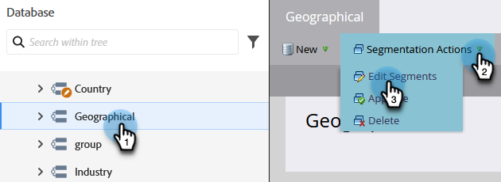

# Prioritet för segmenteringsordning {#segmentation-order-priority}

Det är viktigt att förstå hur **beställa** anger prioriteten för utvärdering av dina personer i en segmentering.

>[!PREREQUISITES]
>
>[Skapa en segmentering](/help/marketo/product-docs/personalization/segmentation-and-snippets/segmentation/create-a-segmentation.md)
>[Definiera segmentregler](/help/marketo/product-docs/personalization/segmentation-and-snippets/segmentation/define-segment-rules.md)

>[!NOTE]
>
>Du kan bara redigera en segmentering i utkastläge.

1. Gå till **Databas**.

   

1. Välj **Segmentering**. I **Segmenteringsåtgärder**, klicka **Redigera segment**.

   

   Du kan kontrollera eller redigera segmentens ordning på den här skärmen.

   

>[!NOTE]
>
>* Segmenten utesluter varandra. En person kan bara vara medlem i ett segment åt gången.
>* När en person kvalificerar sig för två segment tillhör de bara det första i listan.
>* Om en person inte är berättigad till något segment blir han eller hon medlem i standardsegmentet.
