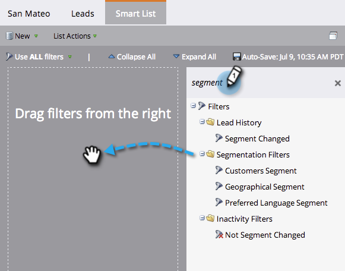

# Använd segmentfilter i en smart lista {#use-segment-filters-in-a-smart-list}

>[!PREREQUISITES]
>
>* [Skapa en smart lista](../../../../product-docs/core-marketo-concepts/smart-lists-and-static-lists/creating-a-smart-list/create-a-smart-list.md)
>* [Skapa en segmentering](create-a-segmentation.md)

>

Optimera prestanda för smarta listor med hjälp av segmentfilter.

1. I den smarta listan som du skapade söker du efter ordet **Segment**, drar och släpper filtret.

   

Bra! Nu vet du hur man hittar segmenteringsfilter.
