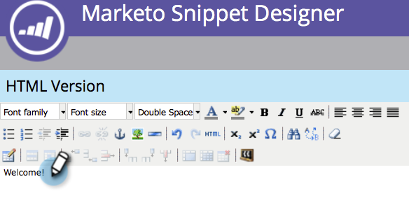

# Lägga till innehåll i ett fragment {#add-content-to-a-snippet}

>[!PREREQUISITES]
>
>[Skapa ett fragment](/help/marketo/product-docs/personalization/segmentation-and-snippets/snippets/create-a-snippet.md)

Du kan lägga till variabler, bilder, filer eller RTF-text i ett fragment.

>[!NOTE]
>
>Du kan inte bädda in några [Marketo e-postsyntax](/help/marketo/product-docs/email-marketing/general/email-editor-2/email-template-syntax.md) i textutdrag, kommer det **not** arbeta i ett mejl. Kodavsnitt ska bara innehålla brödtext (HTML + TEXT).

1. Gå till **Design Studio**.

   

1. Välj **Fragment** och klicka **Redigera utkast**.

   

Du kan lägga till tre typer av innehåll i ett fragment.

## Lägg till token {#add-token}

1. Dra och släpp **Token** -element.

   

1. Retur **Token** och klicka **Infoga**.

   

## Lägg till bild/fil {#add-image-file}

1. Dra och släpp **Bild/fil** -element.

   

   >[!NOTE]
   >
   >Du kan lägga till egna bilder eller filer i Marketo. Läs mer om [bilder och filer](/help/marketo/product-docs/demand-generation/images-and-files/add-images-and-files-to-marketo.md).

1. Välj **Bild** som ska användas och klicka **Infoga**.

   

   >[!NOTE]
   >
   >Du kan också söka efter en viss bild om du vet dess namn.

## Lägg till text {#add-text}

1. Skriv i HTML-versionsområdet för att lägga till text.

   

   >[!TIP]
   >
   >Anpassa texten med formateringsverktygen.

1. För E-post klickar du på **Textversion** -fliken.

   

1. Klicka **Kopiera från HTML**.

   

   >[!NOTE]
   >
   >Bilder, länkar och formatering tas bort i textversionen.

Häftig! Nu kan du skapa olika typer av innehåll för fragmentet.

>[!MORELIKETHIS]
>
>* [Förhandsgranska ett kodavsnitt](/help/marketo/product-docs/personalization/segmentation-and-snippets/snippets/preview-a-snippet.md)
>* [Godkänn ett fragment](/help/marketo/product-docs/personalization/segmentation-and-snippets/snippets/approve-a-snippet.md)

