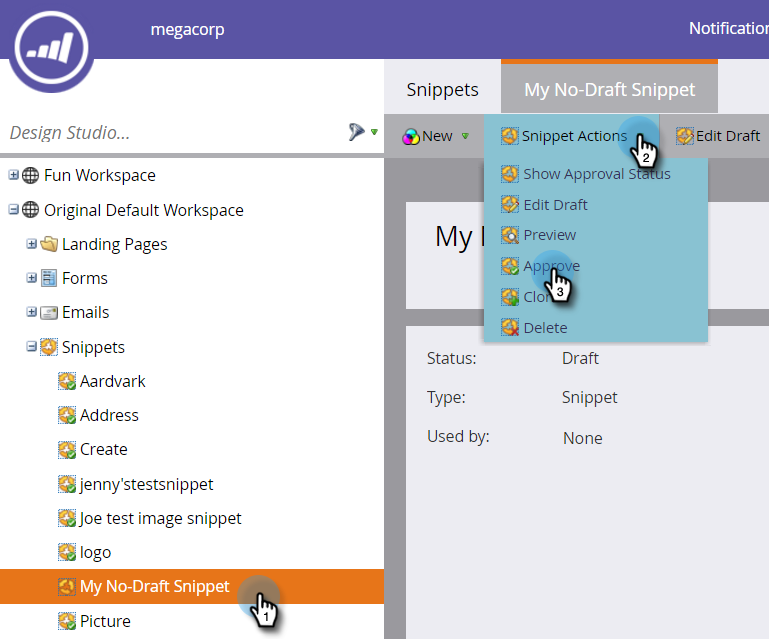

# Godkänn ett kodfragment utan utkast {#approve-a-snippet-with-no-draft}

## Godkänn kodavsnittet {#approve-the-snippet}

Inget utkast utlöses varje gång ett fragment godkänns. Detta inkluderar ett fragment som delas eller refereras av resurser i andra arbetsytor.

1. Gå till **Design Studio**.

   

1. Markera ett fragment och välj **Godkänn** i listrutan **Fragmentåtgärder**.

   

1. Välj ett alternativ i dialogrutan Godkänn fragment och klicka på **Godkänn**:

   * **Uppdatera alla**: Det här alternativet skapar inte utkast av godkända resurser med fragmentet. Alla mediefiler får uppdateringarna och underhåller deras tidigare status. En förloppsmodul visas längst upp till höger på skärmen. den kan stängas när som helst. Om du vill återställa fragmentet högerklickar du på fragmentnamnet och väljer Visa godkännandestatus.
   * **Skapa utkast**: Med det här alternativet skapas utkast av de godkända resurserna med hjälp av fragmentet. Välj det här alternativet om ändringar av kodfragment måste granskas först. Alla utkast måste godkännas manuellt.

   

   >[!NOTE]
   >
   >För ett nytt fragment som inte har använts än visas inte skärmen Godkänn utkast. Det visas när fragmentet används i en eller flera resurser.

>[!CAUTION]
>
>Den här funktionen är utformad för att spara tid med arbetsflödet för godkännande av fragment. Det finns dock några begränsningar att vara medveten om. Mer information finns i [det här dokumentet](https://nation.marketo.com/docs/DOC-4415) . Dokumentet innehåller även felhantering och felsökningsinformation.

>[!MORELIKETHIS]
>
>[Aktivera No-draft för kodfragment](../../../../product-docs/administration/users-and-roles/managing-user-roles-and-permissions/enable-no-draft-for-snippets.md)

