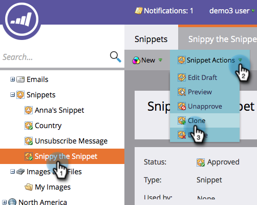

# Klona ett fragment {#clone-a-snippet}

Klona ett fragment för att skapa en kopia som du kan ändra efter behov.

1. Gå till **[!UICONTROL Design Studio]**.

   

1. Gå till fragmentet och klicka sedan på **[!UICONTROL Snippet Actions]** under **[!UICONTROL Clone]**.

   

1. Ange utdragsinformation och klicka på **[!UICONTROL Clone]**.

   

Häftig! Nu kan du ändra det klonade fragmentet efter dina behov.

>[!MORELIKETHIS]
>
>[Redigera fragment med dynamiskt innehåll](/help/marketo/product-docs/personalization/segmentation-and-snippets/snippets/edit-snippets-with-dynamic-content.md)
