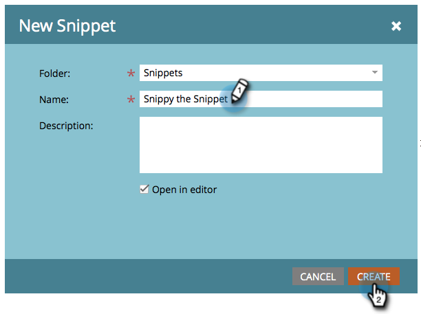

# Skapa ett fragment {#create-a-snippet}

Fragment kan användas som dynamiska innehållsblock på **e-post** - och **landningssidor.**

1. Gå till **Design Studio.**

   

1. Klicka på **Nytt **och sedan **Nytt kodfragment**.

   

1. Ange nödvändig information och klicka på **Skapa**.

   

Bra jobbat! Förenkla arbetet genom att skapa utdrag för dynamiskt innehåll. Nu kan du lägga [till innehåll i det nya fragmentet](add-content-to-a-snippet.md).

>[!MORELIKETHIS]
>
>* [Lägga till innehåll i ett fragment](add-content-to-a-snippet.md)
>* [Dynamiskt innehåll](../../../../product-docs/personalization/segmentation-and-snippets/segmentation/understanding-dynamic-content.md)

>

