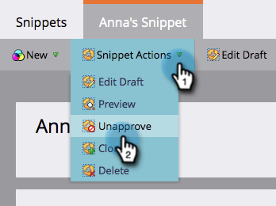

# Avgodkänna ett kodavsnitt {#unapprove-a-snippet}

Ett icke godkänt kodfragment kan inte användas i e-postmeddelanden eller på landningssidor.

1. Gå till **[!UICONTROL Design Studio]**.

   

1. Gå till fragmentet och kontrollera att det inte är **[!UICONTROL Used by]** resurser.

   

   Om fragmentet används av andra resurser tar du bort de associationerna innan du fortsätter.

1. Klicka på **[!UICONTROL Snippet Actions]** i **[!UICONTROL Unapprove]**.

   

Så ja! Utkaststatusen för fragmentet är nu aktiverad så att du kan ändra eller ta bort det.
