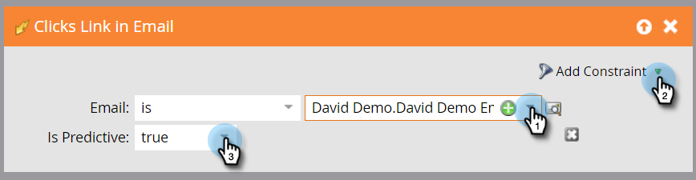

# Definiera en smart lista för aktiviteter för prediktivt innehåll {#define-a-smart-list-for-predictive-content-activities}

>[!NOTE]
>
>Beroende på inköpsdatumet kan din Marketo-prenumeration innehålla antingen Marketo Predictive Content eller Content`AI`. För dem som använder Predictive Content aktiverar Marketo Content`AI` Analytics-funktioner fram till 30 april 2018. Kontakta Marketo Customer Success Manager för att uppgradera till Marketo Content`AI` om du vill behålla funktionerna efter detta datum.

Du kan använda prediktiva innehållsaktiviteter i utlösare och filter när du definierar en smart lista i en smart kampanj. Du kan utlösa en åtgärd för alla som klickar på prediktivt innehåll via [multimediamallen](enabling-predictive-content/enable-predictive-content-for-web-rich-media.md), [innehållsrekommendationsfältet](enabling-predictive-content/enable-the-content-recommendation-bar.md) eller i ett e-postmeddelande.

1. Gå till fliken **Smart List** i den smarta kampanjen.

   

   >[!NOTE]
   >
   >**Djupdykning**
   >
   >
   >Smarta listor kan göra fantastiska saker. Läs mer i [Djupdykning för smart lista](../../product-docs/core-marketo-concepts/smart-campaigns/understanding-smart-campaigns.md).

1. Sök efter utlösaren och dra och släpp den på arbetsytan.

   

   >[!NOTE]
   >
   >En smart kampanj med utlösare körs i utlösarläge. Den körs på en person i taget baserat på händelser som utlösts och filter som lagts till.

1. Klicka på listrutan **Namn** och välj en operator.

   

1. Definiera utlösaren.

   

1. Lägg till **Type**-begränsningen.

   

1. Välj den källa du behöver för den smarta listan.

   

1. Om du använder e-postkällan för ditt prediktiva innehåll lägger du till **Click Link i e-postutlösaren **. Markera din e-post och lägg till **Är prediktiv**-begränsning, definierad som **true**.

   

1. Lägg till eventuella andra filter efter behov.

   

   >[!TIP]
   >
   >I en smart kampanj med både utlösare och filter ligger utlösarna överst. När det aktiveras går bara personer som uppfyller filtervillkoren igenom flödet.

   >[!NOTE]
   >
   >Med flera utlösare går en person igenom flödet om någon av utlösarna aktiveras.

   [definiera en smart lista för en batchsmart kampanj](../../product-docs/core-marketo-concepts/smart-campaigns/creating-a-smart-campaign/define-smart-list-for-smart-campaign-batch.md)

   >[!MORELIKETHIS]
   >
   >
   >    
   >    
   >    * [Definiera smart lista för smart kampanj | Grupp](../../product-docs/core-marketo-concepts/smart-campaigns/creating-a-smart-campaign/define-smart-list-for-smart-campaign-batch.md)
   >    * [Lägg till ett flödessteg i en smart kampanj](../../product-docs/core-marketo-concepts/smart-campaigns/flow-actions/add-a-flow-step-to-a-smart-campaign.md)
   >    * [Definiera en smart lista för webbpersonaliseringsaktiviteter](../../product-docs/web-personalization/working-with-web-campaigns/define-a-smart-list-for-web-personalization-activities.md)
   >    * [Aktivera prediktivt innehåll för multimedia för webben](enabling-predictive-content/enable-predictive-content-for-web-rich-media.md)
   >    * [Aktivera innehållsrekommendationsfältet](enabling-predictive-content/enable-the-content-recommendation-bar.md)

Om du vill köra kampanjen på en uppsättning personer samtidigt ska du lära dig hur du gör .