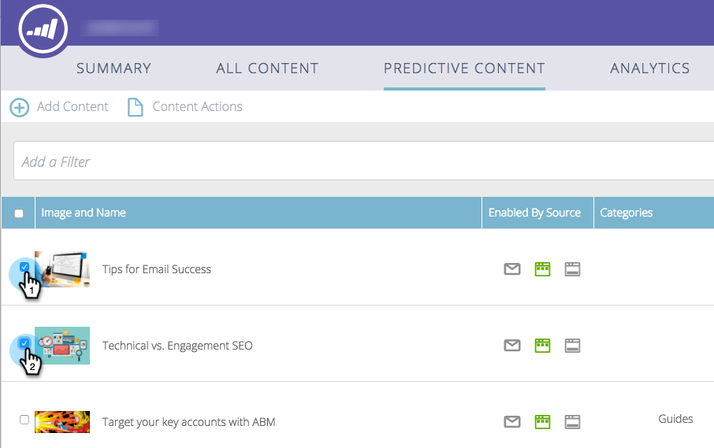

# Aktivera prediktivt innehåll för multimedia för webben {#enable-predictive-content-for-web-rich-media}

Prediktivt innehåll engagerar webbbesökarna med det mest relevanta innehållet, som bygger på maskininlärning och prediktiv analys. Med Web Rich Media kan du förbättra innehållet med textbeskrivningar och bilder och bädda in olika prediktiva innehållsrekommendationer på webbplatsen.

>[!PREREQUISITES]
>
>Innan du aktiverar Predictive Content måste du:
>
>* [Förbered ditt prediktiva innehåll](http://docs.marketo.com/display/docs/edit+predictive+content)
>* [Godkänn en titel för prediktivt innehåll](/help/marketo/product-docs/predictive-content/working-with-all-content/approve-a-title-for-predictive-content.md)

>

När du har förberett innehållets titel, beskrivning och bild för multimedia kan du aktivera enskilda eller flera innehållskomponenter.

1. Om du vill aktivera en enskild titel klickar du på en titel för att öppna redigeraren. Klicka på Multimedia, markera **Aktivera för prediktivt innehåll i rutan Multimedia** och klicka på **Spara**.

   

1. Om det finns flera innehållsdelar på sidan **Prediktivt innehåll** markerar du rutorna intill rubriken/rubrikerna.

   

1. Klicka på listrutan **Innehållsåtgärder** och välj **Aktivera för multimedia** för webben.

   |

## Anpassa JavaScript-koden och bädda in den på din webbplats  {#customize-the-javascript-code-and-embed-it-into-your-website}

Mer information finns i dokumentationen till Rekommendationsmallen för Rich Media [på webbplatsen Marketo Developers.](http://developers.marketo.com/documentation/websites/rtp-rich-media-recommendations-api)Detta förklarar hur du anpassar mallen för webbplatsen.

Klistra in JavaScript-koden på webbplatsen där du vill att mallen ska visas.

**Mallexempel**

* Mall1: Tre vågräta innehållskomponenter med bilder, sidhuvud och beskrivning
* Mall2: Tre vertikala innehållskomponenter med bilder, sidhuvud och beskrivning

Här är ett exempel på rekommendationsmallen för multimedia1:

Här är ett exempel på rekommendationsmallen för multimedia2:

>[!MORELIKETHIS]
>
>* [Aktivera innehållsrekommendationsfältet](enable-the-content-recommendation-bar.md)
>* [Aktivera prediktivt innehåll i e-postmeddelanden](http://docs.marketo.com/x/vLit)

