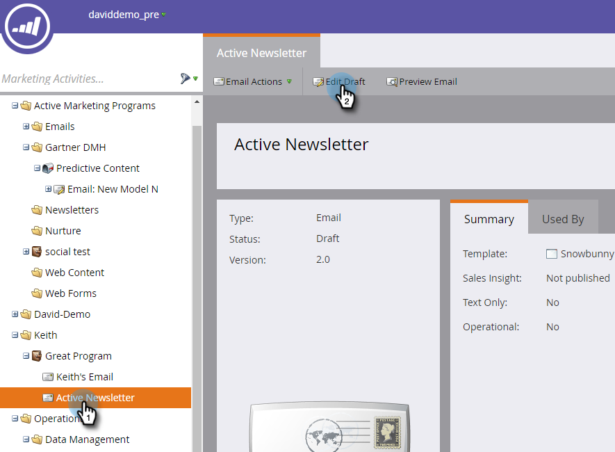

# Aktivera prediktivt innehåll i e-postmeddelanden {#enable-predictive-content-in-emails}

Gör en eller flera bilder i ditt e-postmeddelande prediktiva och skräddarsy upplevelsen för varje mottagare.

>[!NOTE]
>
>Vi rekommenderar att du aktiverar över fem innehållsdelar per kategori och källa (e-post, multimedia, fält) innan du testar och använder Predictive Content. Mer innehåll ger ett bättre prediktivt resultat.

>[!PREREQUISITES]
>
>Innan du aktiverar Predictive Content. du måste:
>
>* [Förbered ditt prediktiva innehåll](/help/marketo/product-docs/predictive-content/working-with-predictive-content/edit-predictive-content-for-emails.md)
>* [Godkänn en titel för prediktivt innehåll](/help/marketo/product-docs/predictive-content/working-with-all-content/approve-a-title-for-predictive-content.md)


## Lägga till prediktivt innehåll med e-postredigeraren {#adding-predictive-content-using-the-email-editor}

1. Klicka på **Marknadsföringsaktiviteter**.

   

1. Markera e-postmeddelandet och klicka på **Redigera utkast**.

   

1. Klicka på bilden som du vill göra prediktiv. När kugghjulsikonen visas klickar du på den och väljer **Aktivera innehåll`AI`** (Content`AI` är det tidigare namnet för Predictive Content).

   

1. Om du vill välja en eller flera kategorier klickar du på listrutan **Kategorier**, markerar dem och klickar på **Använd**.

   

   >[!NOTE]
   >
   >Det är valfritt att välja specifika kategorier eller ändra den förutsägbara layouten.

1. Bilden är nu prediktiv. Upprepa steg 3 och 4 för ytterligare bilder (om du vill).

   

1. Om du vill förhandsgranska e-postmeddelandet klickar du på **Förhandsgranska** i det övre högra hörnet.

   

1. Om du vill visa olika möjliga bilder klickar du på **Uppdatera**.

   

   >[!NOTE]
   >
   >Bilden markeras inte **_förrän mottagaren öppnar e-postmeddelandet_**. Det du ser i förhandsgranskningen är alltså bara ett exempel och behöver inte vara den bild som mottagaren ser.

1. När du har förhandsgranskat e-postmeddelandet klickar du på listrutan **Förhandsgranskningsåtgärder** och väljer **Godkänn och stäng**. Om du fortfarande behöver redigera klickar du på **Redigera utkast** till höger.

   

   >[!NOTE]
   >
   >När du skickar ett prov markeras en slumpmässig bild.

När du har godkänt ditt e-postmeddelande kommer det att vara försett med prediktivt innehåll och klart att skickas!

>[!CAUTION]
>
>När en mottagare öppnar e-postmeddelandet låses prediktiva bilder. Om innehållet tas bort senare visas en trasig bild där innehållet fanns.

## Lägga till prediktivt innehåll när du inte använder e-postredigeraren {#adding-predictive-content-when-not-using-the-email-editor}

Om du inte använder en [Email 2.0](/help/marketo/product-docs/email-marketing/general/email-editor-2/email-editor-v2-0-overview.md)-mall kan du lägga till Predictive Content i e-postmeddelandet genom att helt enkelt tagga en bild i mallen som ett Marketo-redigerbart bildelement.

Läs mer om den [Marketo-specifika syntaxen här](/help/marketo/product-docs/email-marketing/general/email-editor-2/email-template-syntax.md#elements).

Här är ett exempel på hur koden ska se ut (det här är bara ett exempel, kopiera inte koden nedan exakt).

**Exempel**

```example
<div class="mktoImg" id="exampleImg" mktoName="Example Image" mktoImgLink="http://www.marketo.com">  
<a></a>  
</div>
```
