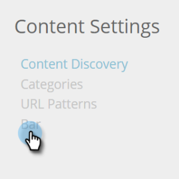

# Aktivera innehållsrekommendationsfältet {#enable-the-content-recommendation-bar}

Innehållsrekommendationsmotorn använder prediktiva analyser och maskininlärningsalgoritmer för att leverera relevant innehåll till varje webbbesökare. Rekommendationsmotorn förutser vilket innehåll som fungerar bäst per besökare. Innehållet i motorn övervakas och styrs via sidan Rekommendationer, som hjälper dig att optimera avkastningen på ditt innehåll.

>[!PREREQUISITES]
>
>Innan du aktiverar Predictive Content måste du:
>
>* **Förbered ditt prediktiva innehåll**
>
>   * [Redigera prediktivt innehåll för e-postmeddelanden](/help/marketo/product-docs/predictive-content/working-with-predictive-content/edit-predictive-content-for-emails.md) eller
>   * [Redigera förebyggande innehåll för multimedia](/help/marketo/product-docs/predictive-content/working-with-predictive-content/edit-predictive-content-for-rich-media.md) eller
>   * [Redigera prediktivt innehåll för rekommendationsfältet](/help/marketo/product-docs/predictive-content/working-with-predictive-content/edit-predictive-content-for-the-recommendation-bar.md)
>
>* [Godkänn en titel för förebyggande innehåll](/help/marketo/product-docs/predictive-content/working-with-all-content/approve-a-title-for-predictive-content.md)

## Aktivera och anpassa innehållsrekommendationsfältet {#enable-and-customize-the-content-recommendation-bar}

1. Gå till **[!UICONTROL Content Settings]**.

   

1. Klicka på **[!UICONTROL Bar]**.

   

1. Om du vill aktivera rekommendationsfältet för en URL klickar du bara på **[!UICONTROL On]** och sedan på **[!UICONTROL Save]**.

   

1. Om du vill anpassa en URL-adress väljer du färger, format, format, pilar för rekommendationsfältet och sidor som ska inkludera eller exkludera fältet. Anpassa sajtens varumärke. Klicka på **[!UICONTROL Save]**.

   

   >[!NOTE]
   >
   >**Inkludera/exkludera visnings-URL**
   >
   >* URL för visning ska vara sökvägen till domänen
   >* Ta inte med https:// eller https://
   >* Använd &#42; för jokertecken
   >* Använda ett semikolon som avgränsare
   >* Exempel: /contact_us&#42;; &#42;action=log&#42;
   >* Det här fältet är skiftlägeskänsligt

## Överväganden i rekommendationsfältet {#recommendation-bar-considerations}

* Du behöver minst en innehållsdel för rekommendationsfältet inställt på **[!UICONTROL On]** på sidan Rekommendationer för att rekommendationsmotorn ska fungera. Om inget innehåll är aktiverat och Bar är inställt på **[!UICONTROL On]**, visas pileffekten längst ned till höger på webbsidan, men inget rekommenderat innehåll visas.

* Ju mer innehåll som körs i rekommendationsmotorn desto bättre för algoritmen att testa och lära sig vilket innehåll som fungerar bäst. Vi rekommenderar att du börjar med 10 till 20 aktiva innehållskomponenter och fortsätter lägga till nya.
* Innehållsdelen som du aktiverar för rekommendation bör innehålla Javascript-taggen RTP. Detta hjälper algoritmen att spåra och optimera rekommenderat innehåll.

>[!MORELIKETHIS]
>
>[Aktivera prediktivt innehåll för multimedia för webben](/help/marketo/product-docs/predictive-content/enabling-predictive-content/enable-predictive-content-for-web-rich-media.md)
