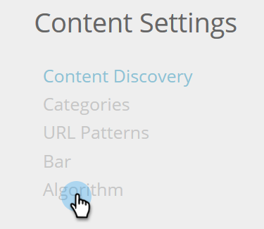

# Inställningar för algoritmmål {#algorithm-goal-settings}

Algoritmmålsinställningar gör att du kan ange slutmålet för algoritmen för artificiell intelligens för prediktivt innehåll som ska anpassas efter dina affärsmål.

1. Klicka på ditt inloggningsnamn i Predictive Content och välj **[!UICONTROL Content Settings]**.

   

1. Välj **[!UICONTROL Algorithm]** under Innehållsinställningar.

   

1. Välj ett mål för varje prediktiv innehållskälla för AI-algoritmen för att maximera innehållets prestanda.

   

   | **[!UICONTROL Clicks]** | Visa innehållet så att personen som tittar på innehållet kan klicka på det |
   |---|---|
   | **[!UICONTROL Conversions]** | Visa det innehåll som mest sannolikt får den som tittar på innehållet att skicka ett formulär |

1. Klicka på **[!UICONTROL Save]** när du är klar.

   
