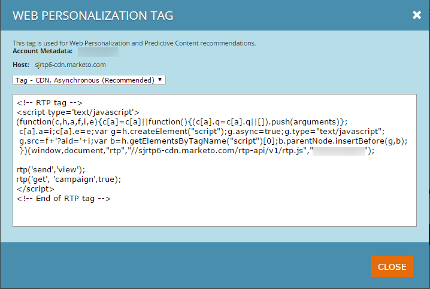

# Distribuera JavaScript för Content-AI {#deploy-the-javascript-for-content-ai}

>[!NOTE]
>
>Beroende på inköpsdatumet kan din Marketo-prenumeration innehålla antingen Marketo Predictive Content eller Content`AI`. För dem som använder Predictive Content aktiverar Marketo Content`AI` Analytics-funktioner fram till 30 april 2018. Kontakta Marketo Customer Success Manager för att uppgradera till Marketo Content`AI` om du vill behålla funktionerna efter detta datum.

Om du vill använda Predictive Content (Predictive Content) måste du skapa och konfigurera RTP (Web Personalization) `tag.`

## Generera tagg {#generate-tag}

1. Logga in på ditt Predictive Content-konto. Gå till **Kontoinställningar**.

   

1. I **Domänkonfiguration** letar du reda på den relevanta domänen och klickar på **Generera tagg.**

   

1. Kopiera och klistra in taggen Web Personalization i webbplatsens HTML-kod.

   

   >[!NOTE]
   >
   >Kopiera JavaScript-taggen för webbanpassning och klistra in den som det första skriptet i sidhuvudet mellan `<head> </head>`-taggarna. Mer detaljerade [implementeringsinstruktioner finns här](http://docs.marketo.com/display/docs/rtp+tag+implementation) [.](http://pages2.marketo.com/rtp-implementation.html)

1. Kontrollera att taggen visas på alla sidor, inklusive landningssidor och underdomäner. Kontrollera detta genom att högerklicka på din `website’s`-sida. Gå till **Visa sidkälla** i en webbläsare. Sök: &quot;RTP&quot;.
1. Bekräfta att växlingsknappen Tagg är inställd på **ON**.

