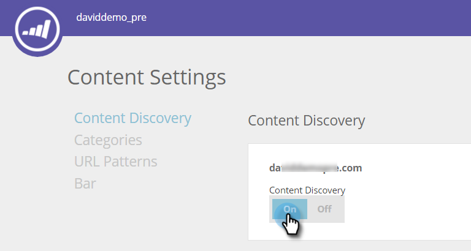

# Aktivera innehållsidentifiering {#enable-content-discovery}

Funktionen för innehållsidentifiering identifierar och taggar automatiskt befintligt innehåll (inklusive fallstudier, blogginlägg, videor, pressmeddelanden etc.) från din webbplats och håller reda på antalet vyer av det här materialet.  Prediktivt innehåll använder det identifierade innehållet och använder prediktiv analys för att avgöra vilket innehåll som är ditt högsta resultat och rekommenderar det bästa innehållet till rätt person.

1. Gå till **Innehållsinställningar**.

   

1. Gör innehållsidentifiering till **På**.

   

Om du ställer in Innehållsidentifiering till På identifieras ett PDF- eller videoinnehåll automatiskt när en webbbesökare klickar på filen eller tittar på videon. Innehållsdelen (URL, innehållsnamn och bild-URL) läggs till och spåras sedan under sidan Allt innehåll. När vi automatiskt identifierar en video identifierar vi en video när en webbbesökare klickar och tittar på en inbäddad video från YouTube, Vimeo eller Wistia. För automatisk identifiering av annat innehåll måste du [skapa innehållsmönster](/help/marketo/product-docs/predictive-content/getting-started/create-content-patterns.md).
