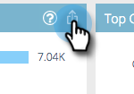

# Prediktiv Content Analytics-översikt {#predictive-content-analytics-overview}

Använd innehållsanalys för att få ytterligare insikter i ert befintliga innehåll, lär dig (baserat på AI och prediktiva algoritmer) vilket innehåll som fungerar för era målgrupper och öka avkastningen från era marknadsföringssatsningar.

>[!NOTE]
>
>Fliken [!UICONTROL Analytics] och innehållsanalysfunktionerna är exklusivt tillgängliga med Marketo Predictive Content.

## Översikt {#overview}

Klicka på **[!UICONTROL Analytics]** på sammanfattningssidan.

[!UICONTROL Analytics] omfattar flera avsnitt: [!UICONTROL Top Content by Views], [!UICONTROL Top Content by Conversion Rate], [!UICONTROL Trending Content], [!UICONTROL Suggested Content] och [!UICONTROL Content].

Håll muspekaren över frågetecknet i ett avsnittshuvud om du vill ha mer information.

Klicka på exportknappen om du vill exportera avsnittets resultat via Excel.

Du kan filtrera resultat efter olika attribut/egenskaper (t.ex. [!UICONTROL ABM Account List], [!UICONTROL Country] osv.).

Klicka på kalenderikonen om du vill ändra datumen för speglade data. Välj en förinställd tidsmängd eller ett visst datumintervall.

## [!UICONTROL Top Content by Views] {#top-content-by-views}

Visar det översta innehållet i antal vyer per valt datumintervall.

## [!UICONTROL Top Content by Conversion Rate] {#top-content-by-conversion-rate}

Visar det översta konverteringsinnehållet efter konverteringsgrad för det valda datumintervallet.

>[!NOTE]
>
>**Definition**
>
>**Konverteringsgrad**: En procentandel beräknad genom direktkonverteringar dividerat med klick.

## [!UICONTROL Trending Content] {#trending-content}

Visar en ökning av populariteten för en del av innehållet genom att titta på den senaste tvåveckorsökningen av visningar jämfört med samma föregående period.

## [!UICONTROL Suggested Content] {#suggested-content}

Visar innehåll som vi föreslår att du marknadsför i dina marknadsföringsaktiviteter baserat på det filter som du har definierat.

Hovra över en bild i Föreslaget innehåll för att visa tillgängliga alternativ.

>[!NOTE]
>
>Ser du ikonerna längst ned? De är från vänster till höger: [!UICONTROL View Content], [!UICONTROL Export to CSV], [!UICONTROL Approve Content].

## [!UICONTROL Content] {#content}

Sök efter önskat innehåll och klicka på det för att se ytterligare information, bland annat: besökarna som tittar på det, ny kontra att återvända, kända och anonyma, de viktigaste platserna som besökarna kom från när de tittade på innehållet och de ledande branscherna de kommer från.

>[!NOTE]
>
>Liknande innehåll baseras på den valda delen av innehållet och beräknas med en associationsregelalgoritm. Resultatet representerar de innehållsdelar som besökarna troligen kommer att klicka på, beroende på den valda delen och besökarens beteende. Filtret eller datumintervallet beaktas inte.
