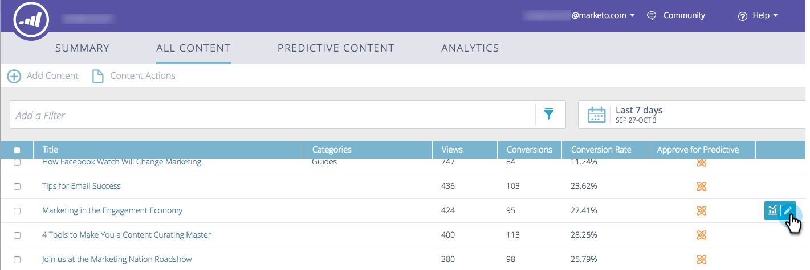

# Redigera innehåll {#edit-content}

Du kan göra vissa ändringar i listor på sidan Allt innehåll.

1. På **Allt innehåll** för du pekaren över raden i titeln som du vill redigera och klickar på redigeringsikonen.

   

1. Gör ändringar i innehållstiteln och innehålls-URL:en (kryssrutan för frågeparametrar är valfri).

   

1. Klicka på **Kategorier** fält för att lägga till/ta bort kategorier. Välj nya i listrutan. Du kan ta bort en markerad kategori genom att klicka på dess **X**.

   

1. Kontrollera **Godkänn för prediktivt innehåll** om du vill godkänna eller avmarkera den ruta som du vill avgodkänna. Klicka **Spara** när det är klart.

   
