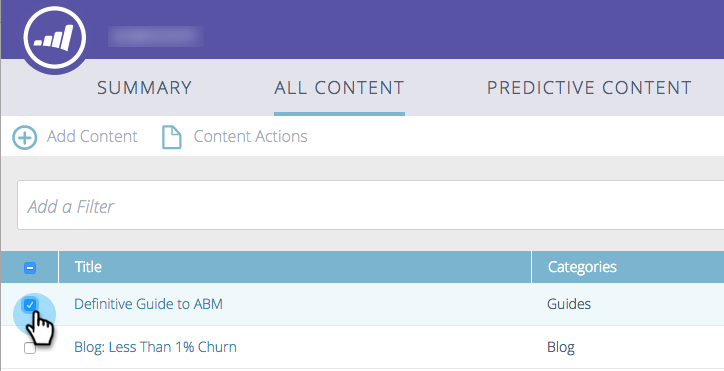

# Avgodkänn en titel för [!UICONTROL Predictive Content] {#unapprove-a-title-for-predictive-content}

Du kan avgodkänna alla titlar för prediktivt innehåll på [!UICONTROL All Content]-sidan eller på popup-fönstret [!UICONTROL Edit Content].

## [!UICONTROL All Content] sida {#all-content-page}

1. Markera kryssrutan bredvid innehållet på sidan [!UICONTROL All Content] för att markera det.

   

1. Klicka på listrutan **[!UICONTROL Content Actions]** och välj **[!UICONTROL Unapprove for Predictive Content]**.

   

## [!UICONTROL Edit Content]-popup {#edit-content-pop-up}

Du kan avgodkänna en titel medan du redigerar den.

1. Håll muspekaren över en del av innehållet och klicka sedan på redigeringsikonen i slutet av raden.

   

1. Avmarkera rutan **[!UICONTROL Approve for Predictive Content]** och klicka på **[!UICONTROL Save]**.

   

Oavsett vilken metod du använder är ikonen för godkännande borta på sidan [!UICONTROL All Content] och titeln försvinner från sidan [!UICONTROL Predictive Content].

