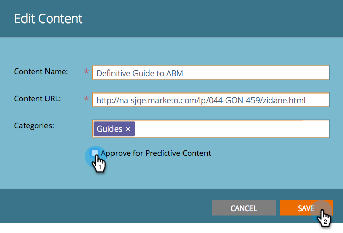

# Avgodkänn en titel för prediktivt innehåll {#unapprove-a-title-for-predictive-content}

>[!NOTE]
>
>Beroende på inköpsdatumet kan din Marketo-prenumeration innehålla antingen Marketo Predictive Content eller Content`AI`. För dem som använder Predictive Content aktiverar Marketo Content`AI` Analytics-funktioner fram till 30 april 2018. Kontakta Marketo Customer Success Manager för att uppgradera till Marketo Content`AI` om du vill behålla funktionerna efter detta datum.

Du kan avgodkänna en titel för prediktivt innehåll på sidan Allt innehåll eller på popup-menyn Redigera innehåll.

## Alla innehållssidor {#all-content-page}

1. Markera kryssrutan bredvid innehållet på sidan Allt innehåll för att markera det.

   

1. Klicka på listrutan **Innehållsåtgärder** och välj **Ogodkänd för Predictive Content**.

   

## Popup-menyn Redigera innehåll {#edit-content-pop-up}

Du kan avgodkänna en titel medan du redigerar den.

1. Håll muspekaren över en del av innehållet och klicka sedan på redigeringsikonen i slutet av raden.

   

1. Avmarkera rutan **Godkänn för prediktivt innehåll** och klicka på **Spara**.

   

Oavsett vilken metod du använder finns ikonen Godkänn på sidan Allt innehåll och titeln försvinner från sidan Prediktiv innehåll.

