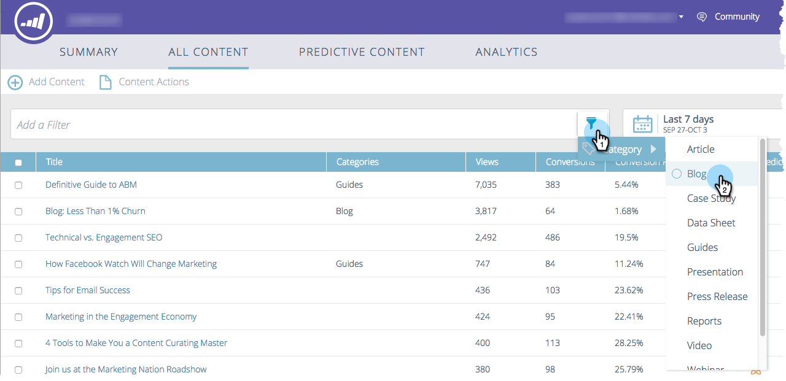

# Förstå allt innehåll {#understanding-all-content}

>[!NOTE]
>
>Beroende på inköpsdatumet kan din Marketo-prenumeration innehålla antingen Marketo Predictive Content eller Content`AI`. För dem som använder Predictive Content aktiverar Marketo Content`AI` Analytics-funktioner fram till 30 april 2018. Kontakta Marketo Customer Success Manager för att uppgradera till Marketo Content`AI`om du vill behålla funktionerna efter detta datum.

På sidan Allt innehåll visas allt innehåll som har identifierats eller lagts till manuellt.   

Sidfälten innehåller:

* **Titel**: Namnet på innehållet
* **Kategorier**: Skapad av dig och används för att gruppera prediktiva resultat för webben eller e-post
* **Vyer**: Totalt antal klick på identifierat webbinnehåll (inklusive alla källor)
* **Konverteringar**: Antalet besökare som visade en del av innehållet och fyllde i ett formulär vid samma besök
* **Konverteringsgrad**: En procentandel beräknad genom direktkonvertering dividerat med klick
* **Godkänn för prediktiv**: Ikonen visas om innehållet har godkänts

Du kan lägga till en ny del av innehållet och spåra den, ta bort en del av innehållet eller godkänna en del av innehållet. När du har godkänt innehållet kan du redigera det på sidan Predictive Content.

## Filtrera innehåll efter kategorier  {#filter-content-by-categories}

Filtrera innehåll genom att markera en eller flera kategorier. Ange sedan datum eller datumintervall för innehållsanalysen med hjälp av standardinställningar eller anpassade inställningar.

1. Klicka på filterikonen på sidan **Allt innehåll** och välj en eller flera innehållskategorier under **Kategori**.

   

1. Nu visas bara innehåll i den kategorin.

   

## Visa analyser för ett datum- eller datumintervall {#display-analytics-for-a-date-or-date-range}

1. Om du vill visa data för ett visst datum eller datumintervall klickar du på kalenderikonen och väljer sedan från den vänstra panelen. Om du vill ange ett anpassat datumintervall klickar du på den första och sista dagen i datumintervallet i kalendern (som visas). Klicka på **Använd**.

   

1. Nu visas analyser för innehåll i det valda datumintervallet.

>[!MORELIKETHIS]
>
>* [Lägg till nytt innehåll](add-new-content.md)
>* [Ta bort innehåll](delete-content.md)
>* [Godkänn en titel för prediktivt innehåll](approve-a-title-for-predictive-content.md)
>* [Avgodkänn en titel för prediktivt innehåll](unapprove-a-title-for-predictive-content.md)

>

