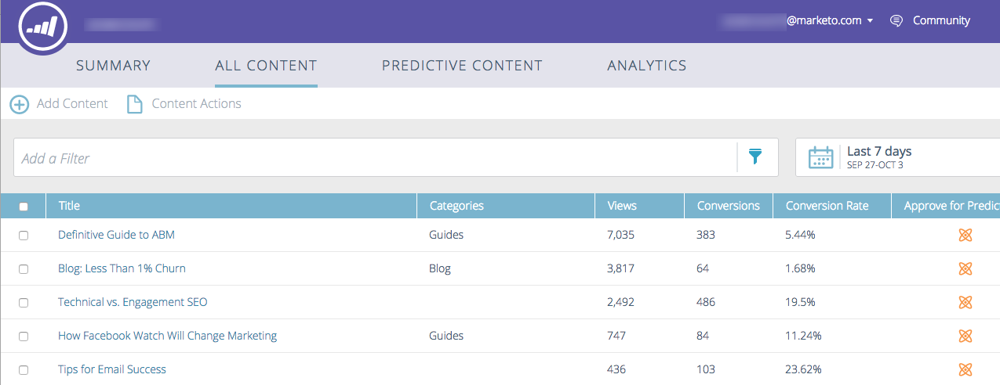
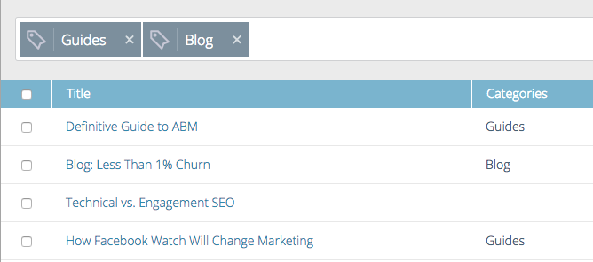

# Förstå allt innehåll {#understanding-all-content}

På sidan Allt innehåll visas allt innehåll som har identifierats eller lagts till manuellt.

Sidfälten innehåller:

* **[!UICONTROL Title]**: Innehållets namn
* **[!UICONTROL Categories]**: Skapad av dig och används för att gruppera dina prediktiva resultat för webb eller e-post
* **[!UICONTROL Views]**: Totalt antal klick på identifierat webbinnehåll (inklusive alla källor)
* **[!UICONTROL Conversions]**: Antalet besökare som tittade på en del av innehållet och slutförde ett formulär vid samma besök
* **[!UICONTROL Conversion Rate]**: En procentandel beräknad genom direktkonverteringar dividerat med klick
* **[!UICONTROL Approve for Predictive]**: Ikonen visas om innehållet har godkänts

Du kan lägga till en ny del av innehållet och spåra den, ta bort en del av innehållet eller godkänna en del av innehållet. När du har godkänt innehållet kan du redigera det på sidan Predictive Content.

## Filtrera innehåll efter kategorier  {#filter-content-by-categories}

Filtrera innehåll genom att markera en eller flera kategorier. Ange sedan datum eller datumintervall för innehållsanalysen med hjälp av standardinställningar eller anpassade inställningar.

1. Klicka på filterikonen på sidan **[!UICONTROL All Content]** och välj en eller flera innehållskategorier under **[!UICONTROL Category]**.

   

1. Nu visas bara innehåll i den kategorin.

   

## Visa analyser för ett datum- eller datumintervall {#display-analytics-for-a-date-or-date-range}

1. Om du vill visa data för ett visst datum eller datumintervall klickar du på kalenderikonen och väljer sedan från den vänstra panelen. Om du vill ange ett anpassat datumintervall klickar du på den första och sista dagen i datumintervallet i kalendern (som visas). Klicka på **[!UICONTROL Apply]**.

   

1. Nu visas analyser för innehåll i det valda datumintervallet.

>[!MORELIKETHIS]
>
>* [Lägg till nytt innehåll](/help/marketo/product-docs/predictive-content/working-with-all-content/add-new-content.md)
>* [Ta bort innehåll](/help/marketo/product-docs/predictive-content/working-with-all-content/delete-content.md)
>* [Godkänn en titel för förebyggande innehåll](/help/marketo/product-docs/predictive-content/working-with-all-content/approve-a-title-for-predictive-content.md)
>* [Avgodkänn en titel för prediktivt innehåll](/help/marketo/product-docs/predictive-content/working-with-all-content/unapprove-a-title-for-predictive-content.md)
