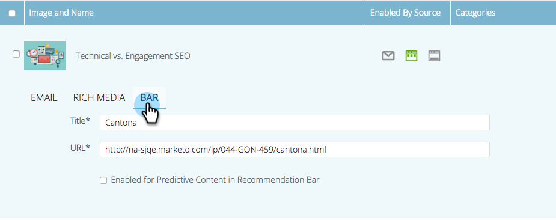

# Redigera prediktivt innehåll för rekommendationsfältet {#edit-predictive-content-for-the-recommendation-bar}

>[!NOTE]
>
>Beroende på inköpsdatumet kan din Marketo-prenumeration innehålla antingen Marketo Predictive Content eller ContentAI. För dem som använder Predictive Content aktiverar Marketo funktioner för innehållsanalysAI till och med 30 april 2018. Kontakta Marketo Customer Success Manager för att uppgradera till Marketo ContentAI om du vill behålla funktionerna efter detta datum.

Så här ställer du in ditt prediktiva innehåll för rekommendationsfältet.

>[!PREREQUISITES]
>
>Innehållet måste vara [godkänt för prediktivt innehåll](/help/marketo/product-docs/predictive-content/working-with-all-content/approve-a-title-for-predictive-content.md) på sidan Allt innehåll.

1. Öppna redigeraren genom att klicka på en titel på sidan **Predictive Content**.

   

1. Klicka på **Fält**.

   

1. Markera kryssrutan om du vill aktivera Predictive Content (Prediktiv innehåll) i rekommendationsfältet.

   

1. Klicka på **Spara**.

   
