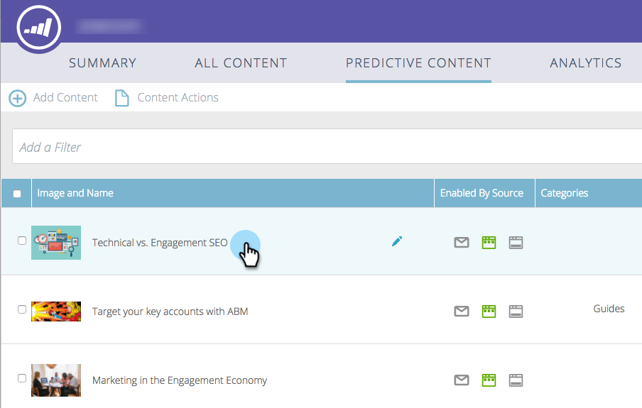

# Redigera prediktivt innehåll för rekommendationsfältet {#edit-predictive-content-for-the-recommendation-bar}

Så här ställer du in ditt prediktiva innehåll för rekommendationsfältet.

>[!PREREQUISITES]
>
>Innehållet måste vara [godkänt för prediktivt innehåll](/help/marketo/product-docs/predictive-content/working-with-all-content/approve-a-title-for-predictive-content.md) på sidan Allt innehåll.

1. Öppna redigeraren genom att klicka på en titel på sidan **[!UICONTROL Predictive Content]**.

   

1. Klicka på **[!UICONTROL Bar]**.

   

1. Markera kryssrutan om du vill aktivera Predictive Content (Prediktiv innehåll) i rekommendationsfältet.

   

1. Klicka på **[!UICONTROL Save]**.

   
