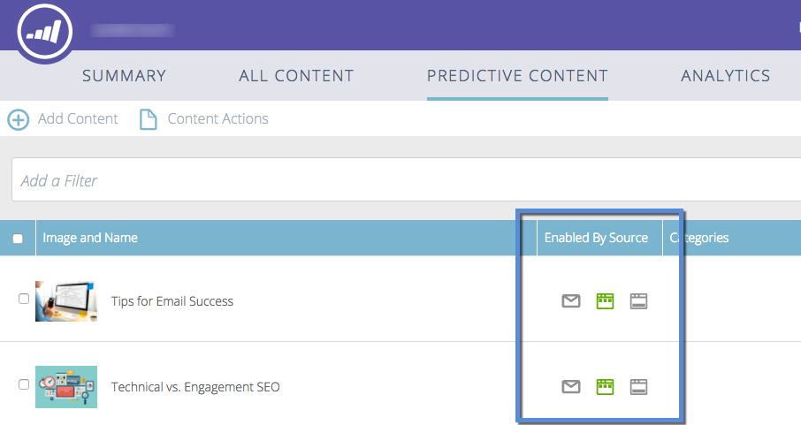

# Förstå prediktivt innehåll {#understanding-predictive-content}

>[!NOTE]
>
>Beroende på inköpsdatumet kan din Marketo-prenumeration innehålla antingen Marketo Predictive Content eller Content`AI`. För dem som använder Predictive Content aktiverar Marketo Content`AI` Analytics-funktioner fram till 30 april 2018. Kontakta Marketo Customer Success Manager för att uppgradera till Marketo Content`AI` om du vill behålla funktionerna efter detta datum.

När du har [godkänt en titel för prediktivt innehåll](/help/marketo/product-docs/predictive-content/working-with-all-content/approve-a-title-for-predictive-content.md) arbetar du med den här. På sidan Predictive Content (Prediktivt innehåll) visas alla titlar som du har godkänt för prediktivt innehåll.

Sidfälten innehåller:

* **Bild och titel**: Namnet på innehållet och den markerade bilden
* **Aktiverad av källa**: Visar om titeln har godkänts för Multimedia, e-post eller rekommendationsfältet.
* **Kategorier**: Skapad av dig och används för att gruppera prediktiva resultat för webben eller e-post
* **Klicka**: Totalt antal klick på rekommenderat innehåll (inklusive alla källor)
* **Konverteringsgrad**: En procentandel som beräknas genom direktkonverteringar dividerat med klick. Hovra för att se ytterligare data (se nedan)
* **Konvertering**: Besökare som tidigare klickat på rekommenderat innehåll och fyllt i ett formulär senare

## Filtrerar innehåll {#filtering-content}

**Kategori**

Du kan filtrera innehåll efter kategorier som du har skapat. Klicka på filterikonen och välj en eller flera innehållskategorier under **Kategori**.

**Aktiverad källa**

Filtrera efter varje typ av aktiverat innehåll: E-post, multimedia, rekommendationsfält.

**Analyser efter källa**

Med filtrering av aktiverat innehåll kan ni se hur varje källa fungerar.

## Visa analys efter datum {#display-analytics-by-date}

1. välj start- och slutdatum till höger (som visas). Klicka på **Använd**.

   

## Visa tabelldata för prediktivt innehåll {#view-table-data-for-predictive-content}

I tabellen kan du se vilka källor som är aktiverade för prediktivt innehåll, från vänster till höger: Rekommendationsfält, e-post och multimedia. Aktiverade källor visas i grönt. Du aktiverar dessa när du [redigerar innehållet](http://docs.marketo.com/display/docs/edit+predictive+content).

Håll markören över fältet i kolumnen Konverteringsgrad om du vill visa konverteringsgrad, direktkonvertering och klickade data.

>[!NOTE]
>
>**Definitioner**
>
>**Konverteringsgrad**: En procentandel beräknad genom direktkonvertering dividerat med klick
>
>**Direktkonvertering**: Besökare som klickat på rekommenderat innehåll och fyllt i ett formulär vid samma besök
>
>**Klickade**: Totalt antal klick på rekommenderat innehåll (inklusive alla tre källorna)

>[!MORELIKETHIS]
>
>* [Prediktivt innehåll](http://docs.marketo.com/display/docs/predictive+content)
>* [Redigera prediktivt innehåll](http://docs.marketo.com/display/docs/edit+predictive+content)

