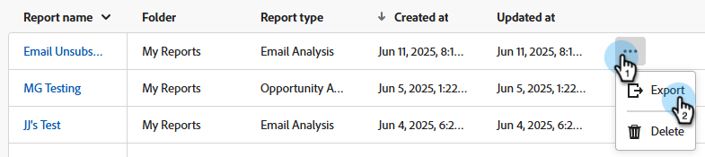

# Översikt över avancerad BI Analytics {#advanced-bi-analytics-overview}

Advanced BI Analytics (f.d. Revenue Explorer och Advanced Report Builder) erbjuder ett flexibelt gränssnitt för rapportering och visualisering av Marketo Engage-data med detaljerad information om utveckling, prestanda med mera. Den har bättre interaktivitet och visualisering, snabbare prestanda och en smidigare och mer intuitiv användarupplevelse.

Dessa förbättringar hjälper er att spara tid, upptäcka mer värdefulla insikter, optimera och dela mer övertygande datamöjligheter med kollegor och intressenter.

>[!PREREQUISITES]
>
>För att få tillgång till den här funktionen måste du ha köpt tillägget Avancerad BI Analytics. Kontakta Adobe Account Team (din kontoansvarige) för mer information.

## Viktiga funktioner och fördelar {#key-features-and-benefits}

* **Högpresterande frågemotor**: Ger fem gånger snabbare prestanda för stora datauppsättningar, vilket möjliggör snabbare databearbetning, snabbare rapportinläsning och en smidigare analysupplevelse.

* **Multimedial och engagerande visualisering**: Olika, utökade samlingar av inbyggda visualiseringsalternativ, inklusive diagram, kartor och KPI-indikatorer, som gör att instrumentpanelerna blir mer insiktsfulla och slagkraftiga och förbättrar datalayouten avsevärt.

* **Avancerad interaktivitet och dynamisk filtrering**: Använd dynamiska utsnitt, korsfiltrering och beroende filter för olika bilder. Flersidiga rapporter har stöd för avancerad fördjupning, fördjupning och fördjupning, vilket ger smidig datautforskande.

* **Intuitivt gränssnitt för rapportredigering**: Med ett musstyrt gränssnitt blir det enklare att skapa rapporter, inklusive flersidiga detaljerade rapporter. Tack vare gränssnittet kan man skapa komplexa, interaktiva rapporter utan att behöva djupa tekniska kunskaper.

* **Enkel delning, inklusive PowerPoint-export**: Den inbyggda delningsfunktionen gör det enkelt att dela insikter. Bland annat kan användarna enkelt generera presentationsfärdiga PowerPoint-bilder.

## Skapa en rapport {#create-a-report}

1. Klicka på rutan **[!UICONTROL Advanced BI Analytics]** i My Marketo.

   {width="800" zoomable="yes"}

1. Klicka på **[!UICONTROL Reports]** på fliken **[!UICONTROL Create Report]**.

   {width="800" zoomable="yes"}

1. Välj önskade mått.

   {width="800" zoomable="yes"}

1. Välj önskade mått.

   {width="800" zoomable="yes"}

1. Välj önskad visualisering.

   {width="800" zoomable="yes"}

1. Lägg till filter genom att dra och släppa ett dimensionsattribut.

   {width="800" zoomable="yes"}

## Exportera en rapport {#export-a-report}

När du exporterar en fullständig rapport är exportalternativen PDF och PPT. Om du behöver dina data i .XLS eller .CSV kan du göra det genom att exportera enskilda visualiseringar ([se nedan](#export-a-visualization)).

>[!BEGINTABS]

>[!TAB Från rapportsidan]

1. På rapportsidan klickar du på ikonen &quot;mer&quot; (..) för den önskade rapporten och väljer **Exportera**.

   

1. Välj PDF eller PPT och klicka på **Exportera**.

   

>[!TAB I rapporten]

1. I själva rapporten klickar du på ikonen&quot;mer&quot; (**..**) i det övre högra hörnet och väljer **Exportera**.

   

1. Välj PDF eller PPT och klicka på **Exportera**.

   

>[!ENDTABS]

### Exportera en visualisering {#export-a-visualization}

Lär dig hur du exporterar specifika avsnitt i rapporten.

1. Välj önskad rapport.

   {width="600" zoomable="yes"}

1. Håll pekaren över den visualisering som visas för att visa tre ikoner.

   {width="600" zoomable="yes"}

1. Klicka på ikonen Mer (**..**)

   

1. Välj **Exportera data**.

   

1. Välj önskat dataformat.

   

   >[!NOTE]
   >
   >* _Data med den aktuella layouten_ är bara tillgängliga för visuella tabeller och matriser.
   >* _Underliggande data_ är inte tillgängliga i Marketo Engage.

1. Välj önskat filformat (.XLS, .CSV).

   

1. Klicka på **Exportera**.

## Videodemo {#video}

I följande video visas ett exempel på en flersidig, detaljerad rapportupplevelse.

>[!VIDEO](https://video.tv.adobe.com/v/3451681/?quality=12&learn=on){transcript=true}

## Standardrapporter i avancerad BI-analys {#standard-reports}

Följande standardrapporter finns som exempel på dina anpassade rapporter.

<table>
  <thead>
    <tr>
      <th>Rapporteringsområde</th>
      <th>Rapportnamn</th>
    </tr>
  </thead>
  <tbody>
    <tr>
      <td rowspan="8">E-postanalys</td>
      <td>E-post - Skickad aktivitet (i CST)</td>
    </tr>
    <tr>
      <td>E-post - klicka på Aktivitet (i CST)</td>
    </tr>
    <tr>
      <td>E-post - öppen aktivitet (i CST)</td>
    </tr>
    <tr>
      <td>E-post - tidsfördelning som klickats (i CST)</td>
    </tr>
    <tr>
      <td>E-post - Öppen prissänkning</td>
    </tr>
    <tr>
      <td>E-post - öppnad tidsfördelning (i CST)</td>
    </tr>
    <tr>
      <td>E-post - Prestandainformation</td>
    </tr>
    <tr>
      <td>E-post - klicka på Sänk tariff</td>
    </tr>
    <tr>
      <td rowspan="8">Leadanalys</td>
      <td>De 10 viktigaste lead-källorna efter konverterade leads</td>
    </tr>
    <tr>
      <td>Top 10 Lead Sources</td>
    </tr>
    <tr>
      <td>SLA Infractions Report</td>
    </tr>
    <tr>
      <td>Åldersrapport för lead</td>
    </tr>
    <tr>
      <td>Balansrapport för lead</td>
    </tr>
    <tr>
      <td>Leadkonverteringsrapport</td>
    </tr>
    <tr>
      <td>Rapport om lead-flöde</td>
    </tr>
    <tr>
      <td>Tidsrapport för lead-övergång</td>
    </tr>
    <tr>
      <td rowspan="5">Programanalys</td>
      <td>De 10 viktigaste programmen efter framgång</td>
    </tr>
    <tr>
      <td>De 10 viktigaste programmen per pipeline</td>
    </tr>
    <tr>
      <td>Scenrapport för programintäkter</td>
    </tr>
    <tr>
      <td>Top 10 Acquisition Programs</td>
    </tr>
    <tr>
      <td>Investeringstrend för marknadsföringskanaler</td>
    </tr>
    <tr>
      <td rowspan="7">Affärsmöjlighetsanalys</td>
      <td>Marknadsföringseffekter på stängda affärsmöjligheter</td>
    </tr>
    <tr>
      <td>Marknadsföringspåverkan på stängda affärsmöjligheter</td>
    </tr>
    <tr>
      <td>Marknadsföringspåverkan på skapade affärsmöjligheter</td>
    </tr>
    <tr>
      <td>(FT) Marknadsföringspåverkan på skapade affärsmöjligheter</td>
    </tr>
    <tr>
      <td>(MT) Marknadsföringspåverkan på stängda affärsmöjligheter</td>
    </tr>
    <tr>
      <td>(MT) Marknadsföringspåverkan på skapade affärsmöjligheter</td>
    </tr>
    <tr>
      <td>(FT) Marknadsföringspåverkan på stängda affärsmöjligheter</td>
    </tr>
    <tr>
      <td>Leadanalys för affärsmöjlighet</td>
      <td>De 10 främsta leadägarna efter säljprojekt vann</td>
    </tr>
  </tbody>
</table>

## Saker att notera {#note}

* Den klassiska&quot;Revenue Explorer&quot;-upplevelsen kommer att bli permanent inaktuell den 10 juni 2025. Under tiden kan ni få tillgång till, skapa, uppdatera och ta bort rapporter i båda upplevelserna.

* Dina anpassade rapporter kommer att replikeras från den klassiska upplevelsen till den nya upplevelsen med de märkbara beteendeförändringar som omnämns i avsnittet [Om den nya upplevelsen](#learning-the-new-experience) nedan.

  >[!IMPORTANT]
  >
  >Replikering av anpassade rapporter kommer att utföras i grupper. När dina anpassade rapporter har replikerats till den nya upplevelsen måste alla ändringar som görs i den klassiska upplevelsen även tillämpas manuellt på motsvarande rapporter i den nya upplevelsen för att säkerställa konsekvens mellan de båda upplevelserna. En informationsanteckning om det ovanstående kommer att visa sig i den klassiska upplevelsen när kundrapporterna replikeras.

   * Kontrollpaneler i den klassiska upplevelsen kan inte överföras och måste återskapas i den nya upplevelsen. De bör återskapas som rapporter i den nya upplevelsen och filtren i den nya upplevelsen hämtar automatiskt möjliga värden i stället för att du måste ange alla möjliga värden manuellt i den klassiska upplevelsen.

     >[!NOTE]
     >
     >Kontrollpanelen i den nya upplevelsen är bara en samling rapporter på en enda sida. Det främsta värdet med kontrollpanelen i den nya upplevelsen är att ni kan presentera analytiska insikter över olika rapporteringsområden.

* Dina e-postprenumerationer i den klassiska upplevelsen kommer att replikeras till den nya upplevelsen. E-postprenumerationerna i den klassiska upplevelsen kommer att fortsätta att fungera tills den klassiska upplevelsen är borttagen den 10 juni 2025.

* Befintliga användare av Intresseutforskaren har automatiskt tillgång till den nya avancerade BI Analytics-upplevelsen.

* Du kan skapa **upp till 700 rapporter** i avancerad BI-analys.

  >[!NOTE]
  >
  >Om du har fler än 700 rapporter i Intresseutforskaren har vissa rapporter kombinerats med andra och konsoliderats via sidor i rapporten.
  >
  >* Om en rapport hade en e-postprenumeration kombinerades den inte.
  >
  >* Resten av rapporterna i _samma mapp_ kombinerades till en eller flera rapporter, per rapportområde. Om det fanns mer än fem rapporter för rapporteringsområdet, konsoliderades de i mer än en sammanslagen rapport.
  >
  >* Varje kombinerad rapport har högst fem sidor.

* Det finns en begränsning på 1 miljon rader per fråga för en given visualisering. Om din fråga överskrider det felet får du följande fel: `The resultset of a query to external data source has exceeded the maximum allowed size of '1000000' rows`. Du kan åtgärda detta genom att minska datumintervallet och/eller justera filtren i rapporten för att minska antalet rader i frågeresultatet.

## Lär dig den nya upplevelsen {#learning-the-new-experience}

Den nya visualiseringsupplevelsen levereras via inbäddad Power BI-tjänst.

En kort självstudiekurs om visualisering finns på Microsoft [Använd bilder i dokumentationen för Power BI](https://learn.microsoft.com/en-us/training/modules/visuals-in-power-bi/){target="_blank"}. Observera att du kanske inte ser alla dessa funktioner i Marketo Engage.

### Betydande upplevelseförändringar {#notable-experience-changes}

Nedan följer förändringar i den nya upplevelsen (Advanced BI Analytics) från den klassiska upplevelsen (Revenue Explorer/Advanced Report Builder).

* Datumtypsfiltret fungerar på samma sätt, men syntaxen för att ange värden har ändrats. I dina befintliga anpassade rapporter konverteras alla filtervärden av datumtyp automatiskt, med undantag för &quot;Day of the Week&quot;, till motsvarande värden i den nya versionen. Stöd för veckodag har upphört.

* Strängtypsfiltren är nu skiftlägeskänsliga.

* Körningsformelfältet i den klassiska upplevelsen stöds inte längre.

* E-postprenumerationen inkluderar PDF-exporten i stället för HTML i rapporten. Den nya e-postprenumerationen kommer inte att innehålla rapportdefinitionen.

* Den djupa länken i rapporten stöds inte just nu.

* PDF export är synkron i den nya upplevelsen jämfört med att vara asynkron i den klassiska upplevelsen.

>[!NOTE]
>
>Du kan inte inkludera mer än ett fält för anpassad fältgrupp i ett visuellt rapportområde för modellprestandaanalys (Leads).

>[!MORELIKETHIS]
>
>[Mått och mått](/help/marketo/product-docs/reporting/advanced-bi-analytics/metrics-and-dimensions.md){target="_blank"}
