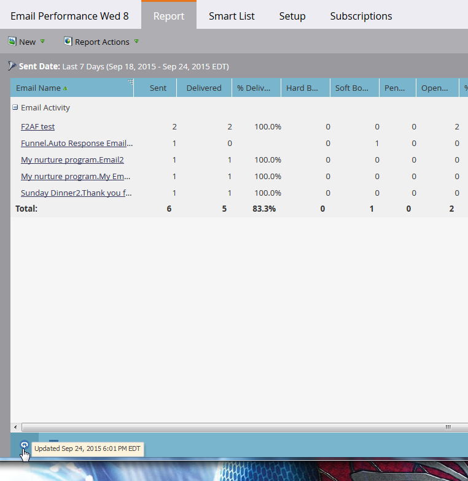

# Uppdatera en rapport {#refresh-a-report}

När du har visat en rapport lagrar Marketo den i databasen så att den läses in snabbt nästa gång du visar den. Efter den första vyn uppdateras rapporter automatiskt var 24:e timme så att de alltid är aktuella. Men du kan uppdatera dem manuellt när du vill.

1. Håll markören över ikonen med cirkelpilen i det nedre vänstra hörnet för att se när rapporten senast uppdaterades.

   

1. Ikonen med cirkelpilen är uppdateringsknappen. Klicka bara på den för att få de senaste resultaten.

   

1. Du kan också uppdatera rapporten genom att klicka på **rapportåtgärder** -menyn och välja **Uppdatera rapport**.

   

   Voilà!

