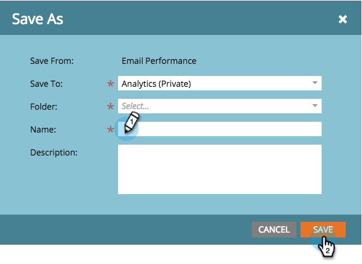

# Spara en rapport {#save-a-report}

Ibland kan du behöva spara en standardrapport för att kunna visa den igen senare. Så här kan du göra:

1. Gå till området **[!UICONTROL Analytics]**.

   

1. Välj en [rapporttyp](/help/marketo/product-docs/reporting/basic-reporting/report-types/report-type-overview.md).

   

1. Klicka på **[!UICONTROL Report Actions]** och välj **[!UICONTROL Save As]**.

   

1. **[!UICONTROL Save To]** en plats och välj en **[!UICONTROL Folder]**.

   

1. **[!UICONTROL Name]** rapporten och klicka på **[!UICONTROL Save]**.

   

   Häftig! Din sparade rapport visas nu i trädet.

   

>[!MORELIKETHIS]
>
>Lär dig hur du [klonar en rapport för att gruppera rapporter](/help/marketo/product-docs/reporting/basic-reporting/report-activity/clone-a-report-to-group-reports.md).
