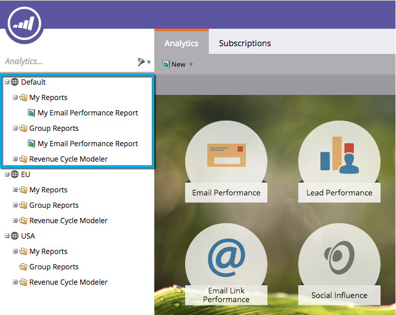

# Förstå mina rapporter och grupprapporter {#understanding-my-reports-and-group-reports}

Du kan skapa **Mina rapporter **och **Grupprapporter **från [analysstartsidan](navigating-the-analytics-home-page.md).

**Mina rapporter** är bara synliga för dig.

**Grupprapporter** är synliga för alla användare på den arbetsytan.

>[!NOTE]
>
>Varje arbetsyta har en uppsättning **Mina rapporter **och **Grupprapporter**.

>[!NOTE]
>
>**Relaterade artiklar**
>
>* [Spara en rapport](save-a-report.md)
>* [Klona en rapport till grupprapporter](../../../../product-docs/reporting/basic-reporting/report-activity/clone-a-report-to-group-reports.md)

>

