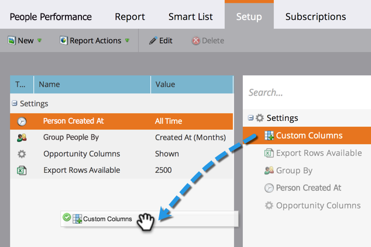
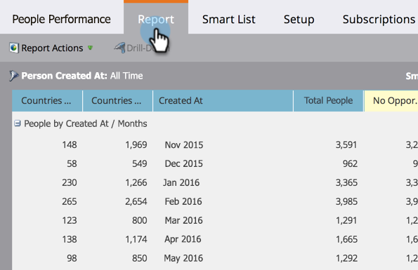

# Lägg till anpassade kolumner i en personrapport {#add-custom-columns-to-a-person-report}

Du kan filtrera mätvärdena i dina [personrapporter](http://docs.marketo.com/display/docs/basic+reporting) ytterligare genom att använda dina [smarta listor](http://docs.marketo.com/display/docs/smart+lists+and+static+lists) som anpassade kolumner.

1. Gå till området **Marknadsföringsaktiviteter** (eller **Analytics**).

   

1. Markera rapporten och klicka på fliken **Inställningar** .

   

1. Dra över **anpassade kolumner**.

   

1. Välj de smarta listor som ska användas som rapportkolumner.

   

   >[!NOTE]
   >
   >**Djupdykning**
   >
   >
   >Lär dig hur du skapar och konfigurerar smarta listor i djupet [Smarta listor och Statiska listor](http://docs.marketo.com/display/docs/smart+lists+and+static+lists) .

1. Du har gjort det! Klicka på fliken **Rapport** för att visa rapporten med de nya kolumnerna.

   

   >[!NOTE]
   >
   >**Relaterade artiklar**
   >
   >
   >Du kan också [lägga till säljprojektskolumner i en lead-rapport](add-opportunity-columns-to-a-lead-report.md).

   >[!NOTE]
   >
   >**Djupdykning**
   >
   >
   >Lär dig mer om många saker du kan göra med rapporter i djupet för [Basic Reporting](http://docs.marketo.com/display/docs/basic+reporting) .

