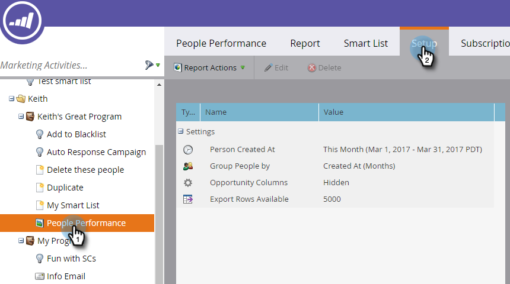

# Ändra en tidsram för rapport {#change-a-report-time-frame}

Ändra den tidsperiod som rapporten omfattar så att den fokuserar på en viss tid av aktivitet.

>[!NOTE]
>
>**FYI**
>
>Marketo standardiserar nu språk för alla prenumerationer, så du kan se lead/leads i din prenumeration och person/personer på docs.marketo.com. Dessa termer betyder samma sak. det påverkar inte artikelinstruktionerna. Det finns andra förändringar också. [Läs mer](http://docs.marketo.com/display/DOCS/Updates+to+Marketo+Terminology).

1. Gå till området **Marknadsföringsaktiviteter** (eller **Analytics**).

   

1. Välj rapporten i navigeringsträdet och klicka på fliken **Inställningar** .

   

1. Dubbelklicka på tidsbildrutefältet, som har olika etiketter beroende på rapporttyp:

   * **Person skapad den**, i personrapporter
   * **Skickat den**, i e-postrapporter
   * **Aktivitetsdatum**, i alla andra rapporter

   

   >[!NOTE]
   >
   >**Den person som skapades den** här hänvisar till den tidpunkt då personen blev känd i din databas.

1. Välj lämplig tidsram i listrutan.

   

   >[!TIP]
   >
   >Om du vill ange specifika datum väljer du **Anpassad** i listrutan och anger datumen i **Från** - och **Till** -kalenderfälten.

   Klicka på fliken **Rapport** för att visa rapporten för den valda tidsramen.\
   

   >[!NOTE]
   >
   >**Relaterade artiklar**
   >
   >
   >Om du vill begränsa rapporten efter specifika personattribut kan du [filtrera personer i en rapport med en smart lista](filter-people-in-a-report-with-a-smart-list.md).

   >[!NOTE]
   >
   >**Djupdykning**
   >
   >
   >Mer information om hur du använder rapporter finns i djupdykningen för [grundläggande rapportering](http://docs.marketo.com/display/docs/basic+reporting) .

