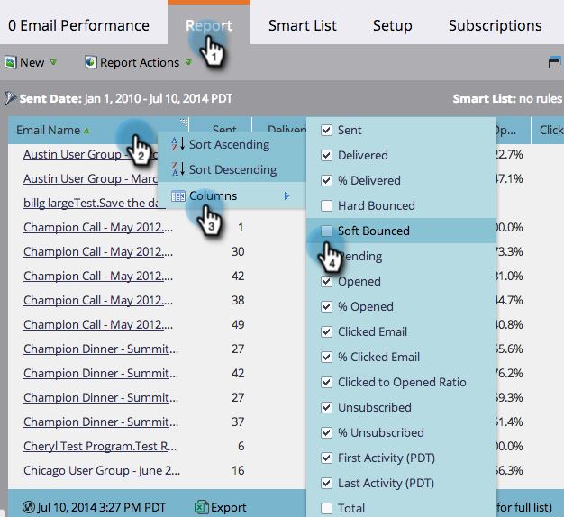

# Välj rapportkolumner {#select-report-columns}

Du kan välja vilka kolumner som är och inte är inkluderade i rapporten.

1. Gå till området **[!UICONTROL Analytics]** (eller **[!UICONTROL Marketing Activities]**).

   

1. Välj din rapport.

   

1. Klicka på fliken **[!UICONTROL Report]**, klicka på en kolumnrubrik och välj **[!UICONTROL Columns]**. Välj sedan de kolumner som ska inkluderas.

   

   >[!MORELIKETHIS]
   >
   >[Sorteringsrapport för kolumner](/help/marketo/product-docs/reporting/basic-reporting/editing-reports/sort-report-on-columns.md)
